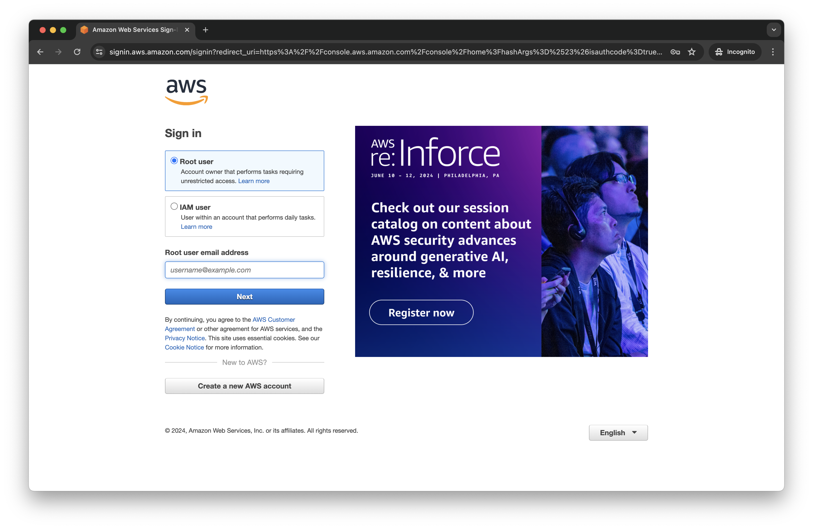
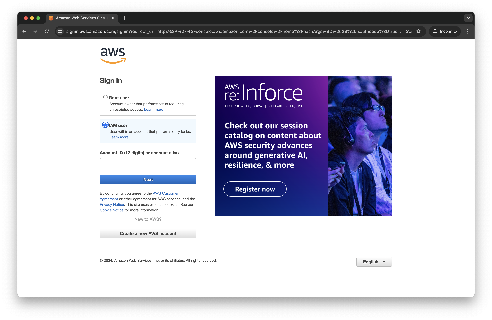
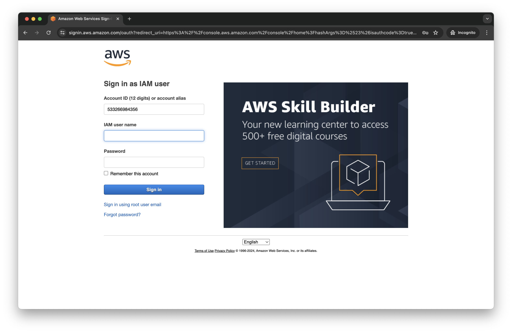
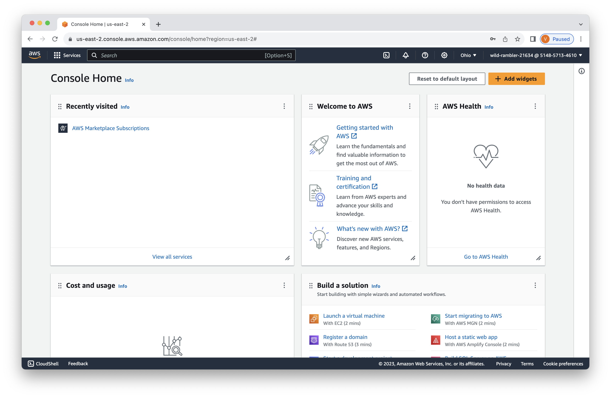

# Lab 0 - Sign In
At the start of this lab, you should have received an information sheet. To begin, visit https://events.oneblink.ai and input the email you used to register for the lab, along with the event code (a 7-digit number) from the information sheet. Check the box to agree to the Terms and Conditions, and then click on Register.

Check your mailbox to get the OneBlink validation code, then copy the code.

Enter your email, the event code from the information sheet, and the validation code from your email, then click on the "Access Sandbox" button.

Once the entered information is validated, you will receive your own AWS and Neo4j accounts. Please refrain from sharing this account information with fellow attendees, as it is specifically assigned to you. Remember to save this information, as you will need it until the end of the lab. These accounts will be terminated by the end of the day.

## Improving the Labs
As you work through these labs, we'd really appreciate your feedback.  One way to help us improve is to open an issue by going [here](https://github.com/neo4j-partners/hands-on-lab-neo4j-and-sagemaker/issues).  Outright bugs, usability suggestions, and general comments are all appreciated.  Pull requests are great too!

## Sign into AWS
We're going to sign into a new AWS account.  You may already have other AWS accounts.  If you use Chrome, you might consider using incognito mode for these exercises.  That's not mandatory though and other browsers work fine too.
Our next step is to open the AWS console [here](https://console.aws.amazon.com/). 

Select "IAM User."

Now enter the Account ID you were given and click "Next."

Enter the IAM user name and Password you were given.  Click the check box for "Remember this account."  Click "Sign in."

We're now authenticated and logged into the AWS console.

At this point you can click through to dismiss any help dialogs.  In the next lab we'll deploy Neo4j.

## Progress:  █░░░░░░ 1/7 Labs Completed!

