# Lab 0 - Signup for AWS
First off, you're going to need an AWS account.  

If you have an AWS account already, you may be able to use that.  Your account would need permissions that allow you to deploy a SageMaker domain and deploy from Marketplace.  It would also need a default VPC with public access.  If your account meets those requirements, you can skip down to the "Apply AWS Credits" section of this lab.

## Signup for AWS
If you don't have an account yet, you go [here](https://aws.amazon.com/) to sign up for one.

You'll need to provide your phone number and credit card information.  Total costs for the lab should be significantly under $10.  Those will be more than offset by a credit that AWS is providing for lab attendees.  At the end of the lab we'll show you how to delete any resources you've deployed as well.

Click on "Create an AWS Account" in the upper right.

Enter an email address and a name for the account.

Check your email and enter the code to verify the account.

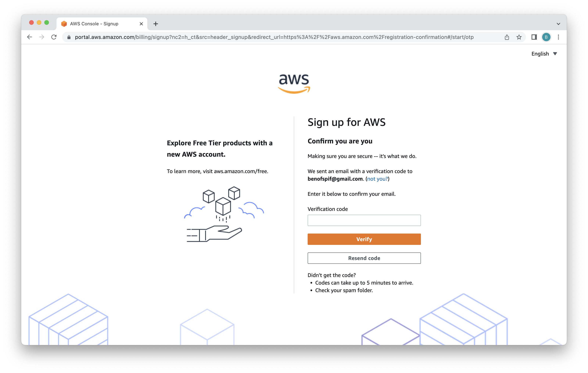

Now set a password.

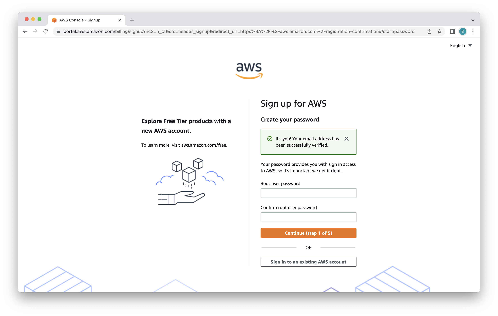

Select "Personal" for the account type and fill out the form.  Review and accept the terms.  Then click "Continue."

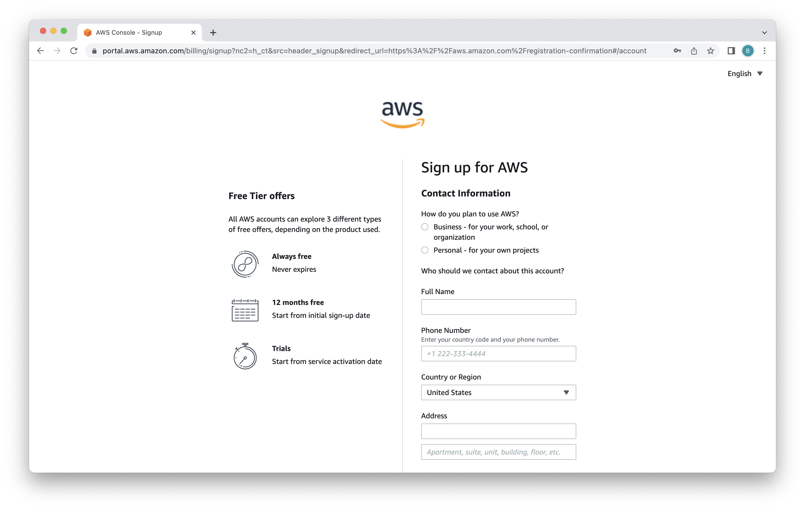

Enter a credit card.  Note that this card will only be charged if you exceed the credits provided for this lab.  Nothing we're doing in this lab would exceed those credits.  We're going to deploy the Neo4j Marketplace listings.  The IaaS charges for that will total a few dollars for the duration of the lab.  All the other resources we're using will be below the free tier threshold.

If you follow the instructions to turn off the resources we deploy, you'll be left with a credit in your account.

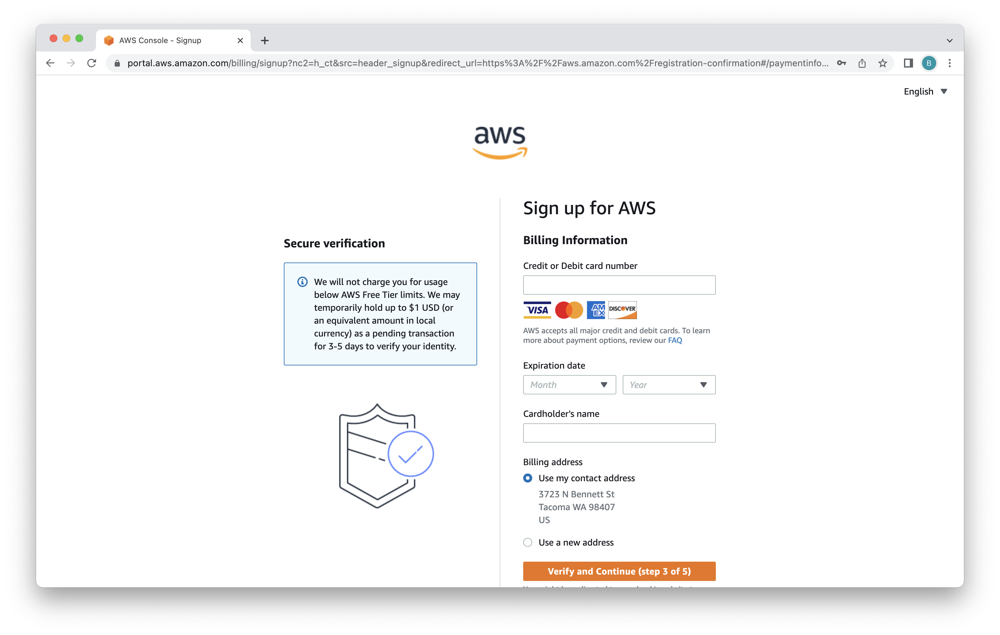

Now enter your phone number to receive a verification code.

Enter the verification code that was texted to you.  Click "Continue."

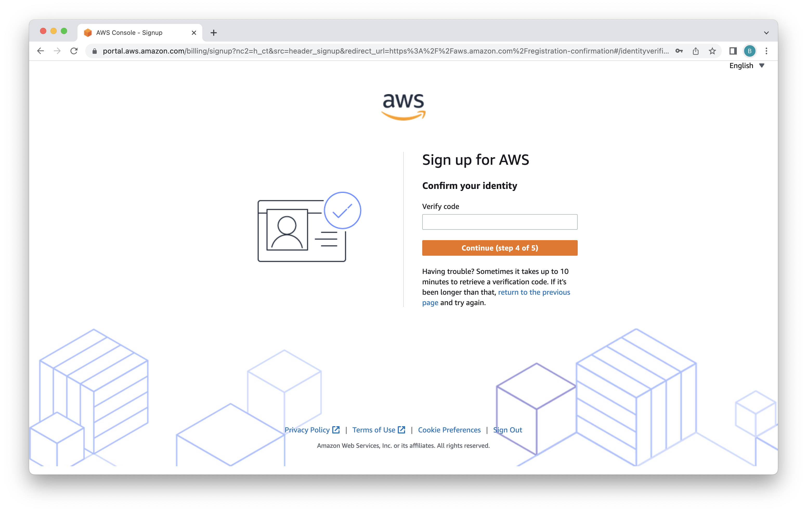

Select "Basic Support - Free" and click "Complete sign up."

Congratulations!  You've just signed up for an AWS account.  Click "Go to the AWS Management Console." 

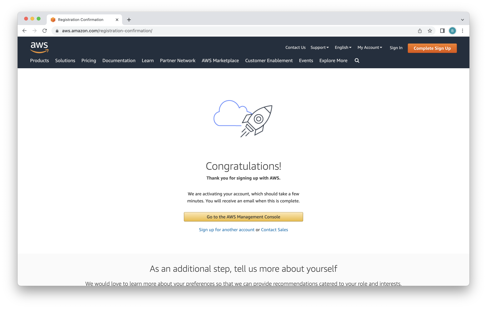

## Login
Enter the email address you provided during signup to login to your new AWS account.

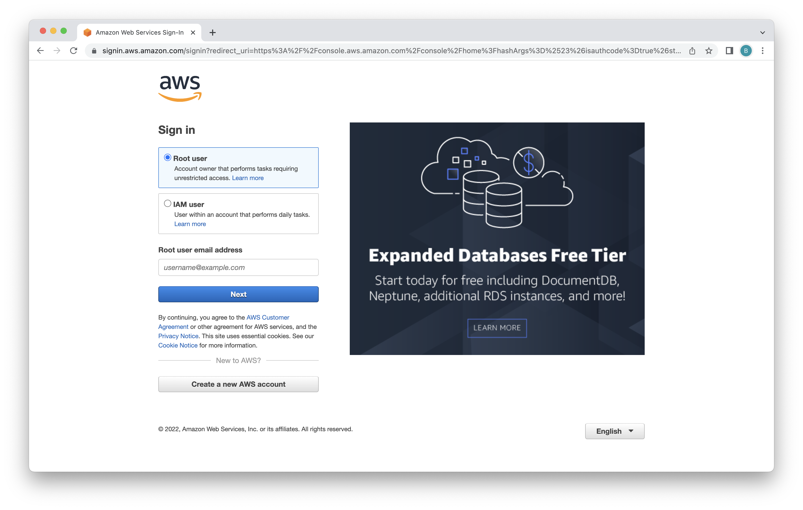

Enter the password you provided during signup and click "Sign in."

Complete the captcha and click "Submit."

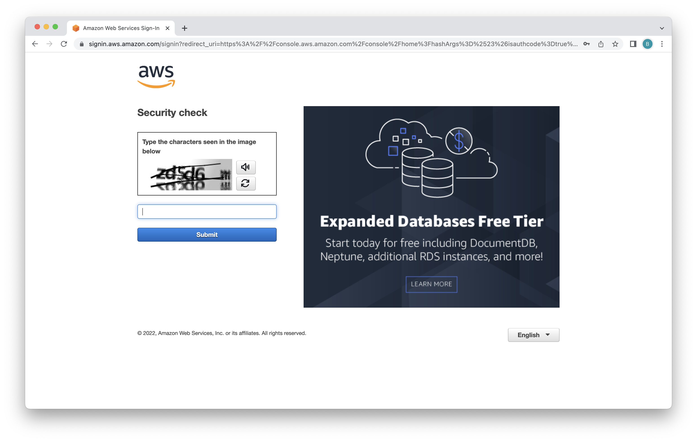

Click "Switch to new Console Home" to use the latest console.

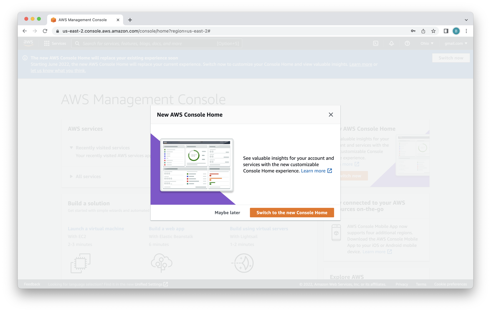

You're now in the console!  Click next to move through the tutorial.

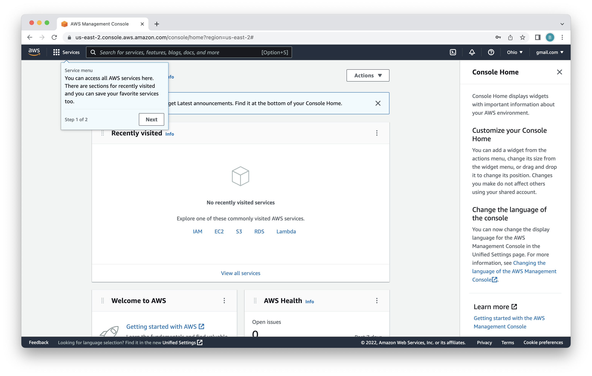

Click "Done" to dismiss the tutorial.

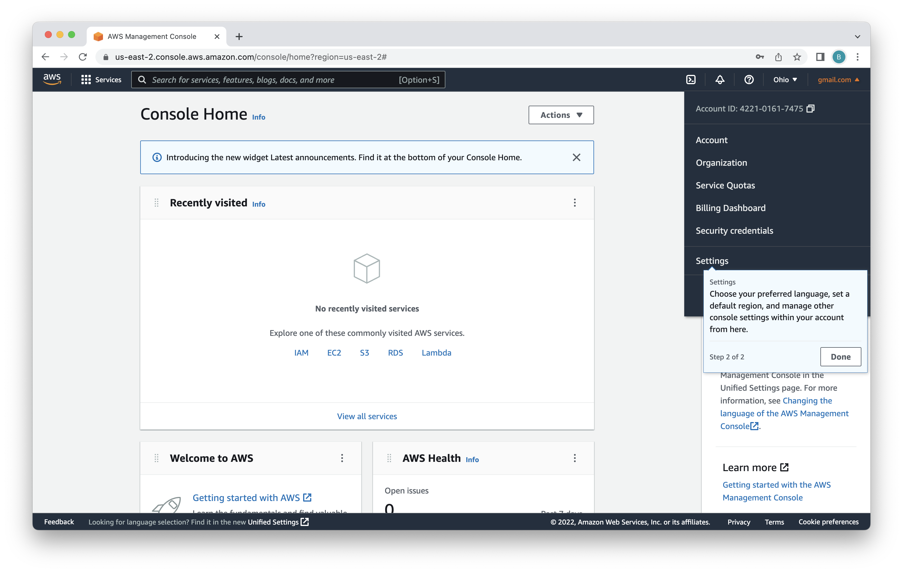

Click the "X" in the upper right to dismiss the help menu.

Click "X" again to dismiss another help menu.

You're now all logged in to your environment and ready to use it.

## Apply AWS Credits
As part of the labs, AWS is providing credits.  The credits should far exceed the cost of resources consumed during this lab.  You can apply the credits to your account by navigating [here](https://console.aws.amazon.com/billing/home?#/credits)

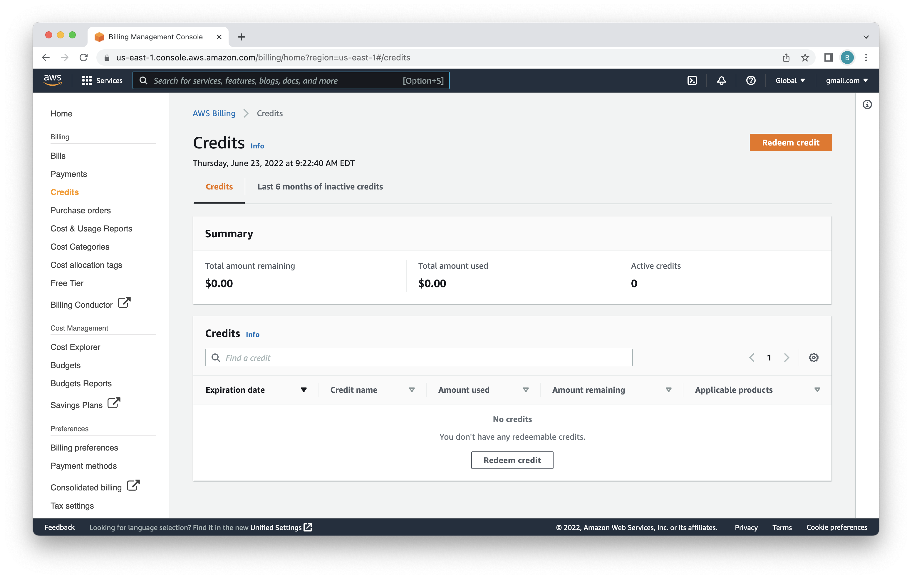

Once there, click on "redeem credit."

You'll then need to enter the code for the credit and answer the captcha.  With that complete, click "Redeem credit."