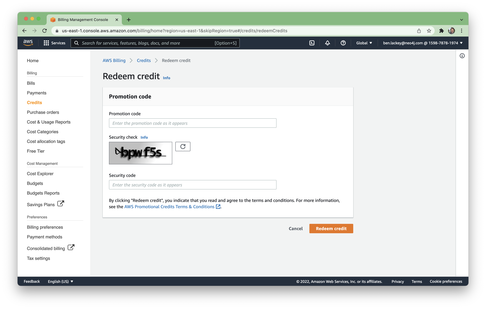

# Lab 0 - Signup for AWS
First off, you're going to need an AWS account.  

If you have an AWS account already, you may be able to use that.  Your account would need permissions that allow you to deploy a SageMaker domain and deploy from Marketplace.  It would also need a default VPC with public access.  If your account meets those requirements, you can skip down to the "Apply AWS Credits" section of this lab.

## Signup for AWS
If you don't have an account yet, you go [here](https://aws.amazon.com/) to sign up for one.

You'll need to provide your phone number and credit card information.  Total costs for the lab should be significantly under $20.  Those will be more than offset by a credit that AWS is providing for lab attendees.  At the end of the lab we'll show you how to delete any resources you've deployed as well.

## Apply AWS Credits
As part of the labs, AWS is providing credits.  The credits should far exceed the cost of resources consumed during this lab.  You can apply the credits to your account by navigating [here](https://console.aws.amazon.com/billing/home?#/credits)

Once there, click on "redeem credit."

You'll then need to enter the code for the credit and answer the captcha.  With that complete, click "Redeem credit."