# Lab 1 - Deploy Neo4j
In this lab, we're going to deploy Neo4j Enterprise Edition from the AWS Marketplace.  That listing has a Cloud Formation template under it that we'll inspect.  We'll also look at more customizable deployment options.

## Sign up for AWS
The most basic thing you're going to need for these labs is an AWS account.  If you don't have an account yet, you can sign up for one [here](https://aws.amazon.com/).

You'll need to provide your phone number and credit card information.  Total costs for the lab should be significantly under $50.  At the end of the lab we'll show you how to delete any resources you've deployed as well.

## Apply AWS Credits
As part of the labs, AWS is providing credits.  The credits should far exceed the cost of resources consumed during this lab.  You can apply the credits to your account by navigating [here](https://console.aws.amazon.com/billing/home?#/credits)

Once there, click on "redeem credit."

You'll then need to enter the code for the credit and answer the captcha.  With that complete, click "Redeem credit."

## Pick a Region
For this lab, you'll want to pick one AWS region to put all your resources in.  It doesn't particularly matter which region you use.  That said, if you use the default region for your account, things will probably be simpler.  You can tell which region is selected by looking in the upper right of the AWS console [here](https://console.aws.amazon.com/).  In the image below, the region is N. Virginia, also known as us-east-1.

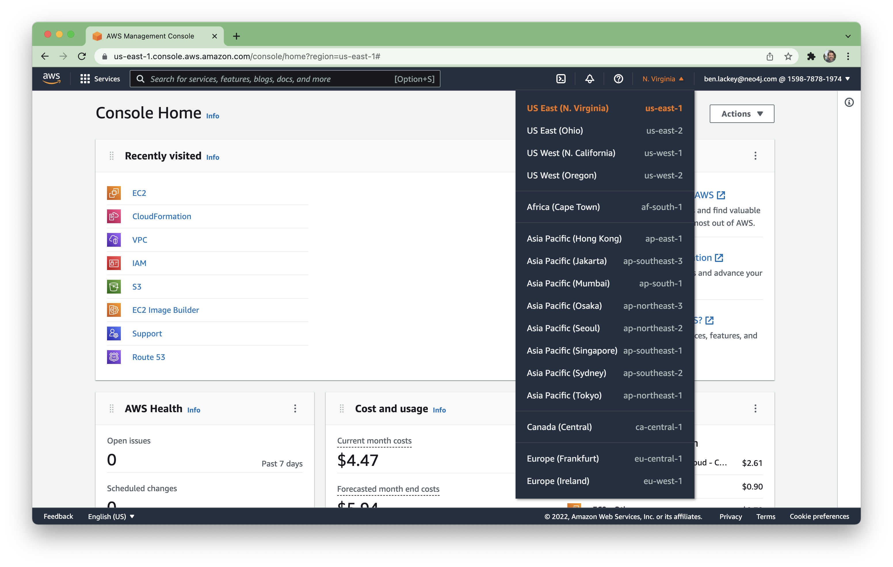

Whatever region you select, make sure that you're logged into it as you proceed through the following steps.

## Create a Key Pair
The machine we're going to create for the lab will be an EC2 instance.  We'll need to create a key pair to connect to the instance.

If you don't have a key pair already, follow through these steps.  First, navigate to the console [here](https://console.aws.amazon.com/).  

Now, type "Key pairs" in the search bar at the top of the console.  Click on the "key pairs" result that shows up under "Features."

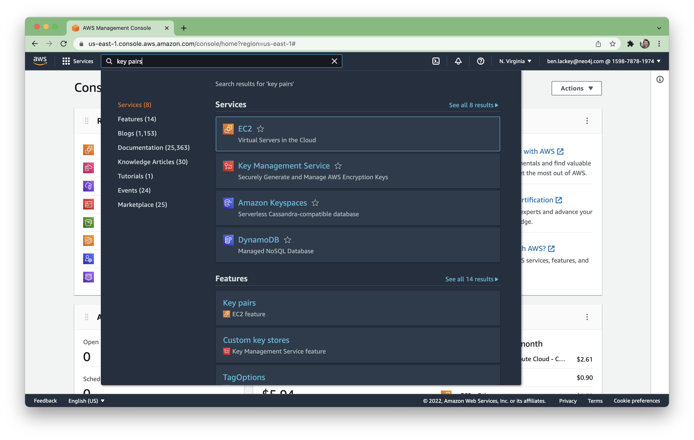

In this window, you'll see a list of existing key pairs.  Unless you have an old key pair that you want to use, you should click "Create key pair" in the upper right.

This menu is for creating the key pair.  For a name, type neo4j-sagemaker.  All the other defaults will work.  So, accept those and click "Create key pair."

That leads us back to our list of key pairs.  You can see the newly created key paid.  In my case, I'm using Chrome on a mac.  The private key was automatically downloaded to my ~/Downloads folder.  You can see it in the lower left of the browser.

In order to connect to the instance later, we'll need the private key in the path for our SSH client.

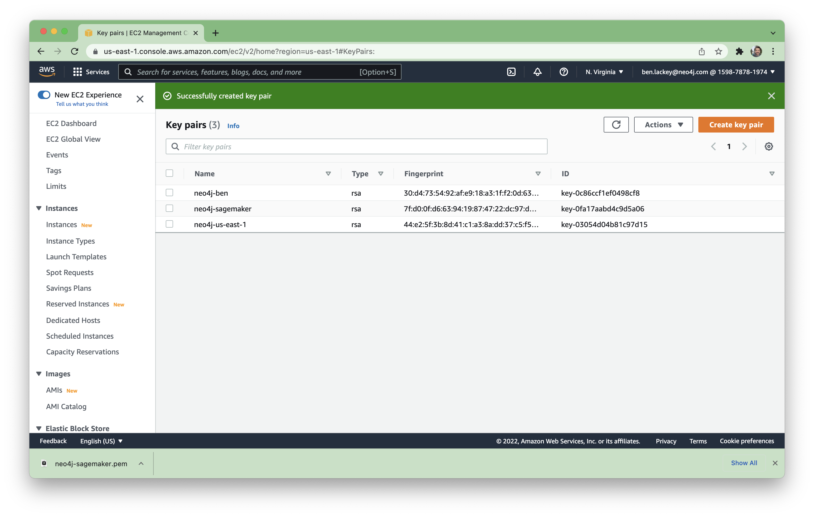

On a mac you can open a terminal and run these commands to move the key and then set the permissions:

    mv ~/Downloads/neo4j-sagemaker.pem ~/.ssh/
    chmod 400 ~/.ssh/neo4j-sagemaker.pem

That's it!

## Configure VPC
AWS accounts are created with a default VPC.  We're going to be using that for this deployment.  Sometimes people delete the default VPCs in their accounts.  Let's check and make sure the default VPC exists and is properly configured.  To do that, open an AWS console [here](https://console.aws.amazon.com/).

Type "VPC" in the search bar and select "VPC" under services.

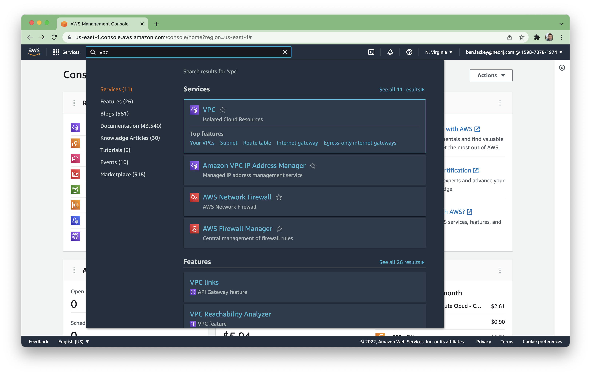

In the VPC menu, select "VPCs."

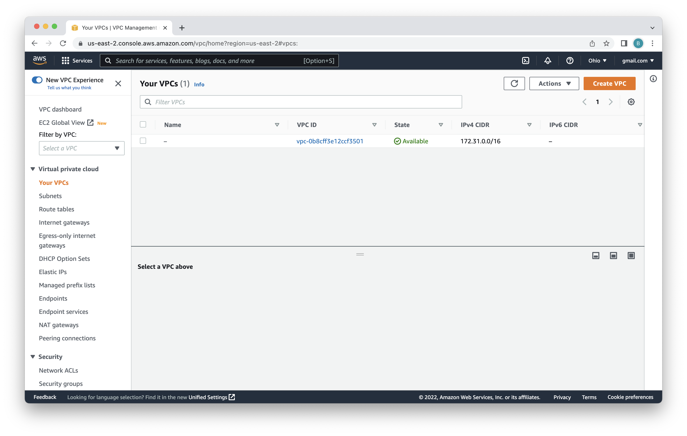

That will give us a view of our VPCs.  With any luck, you'll already have at least one.  In my case, I have two.

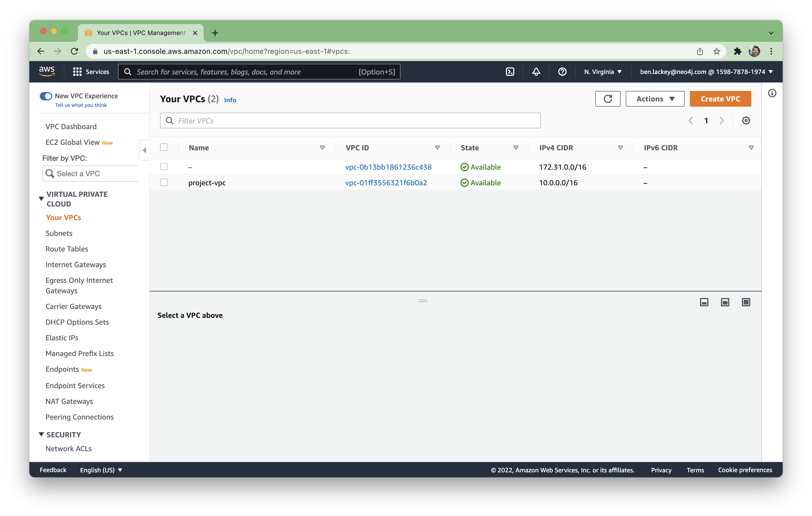

Now scroll to the right of the VPC view and check if one of the VPCs has the value "Yes" under "Default VPC."  

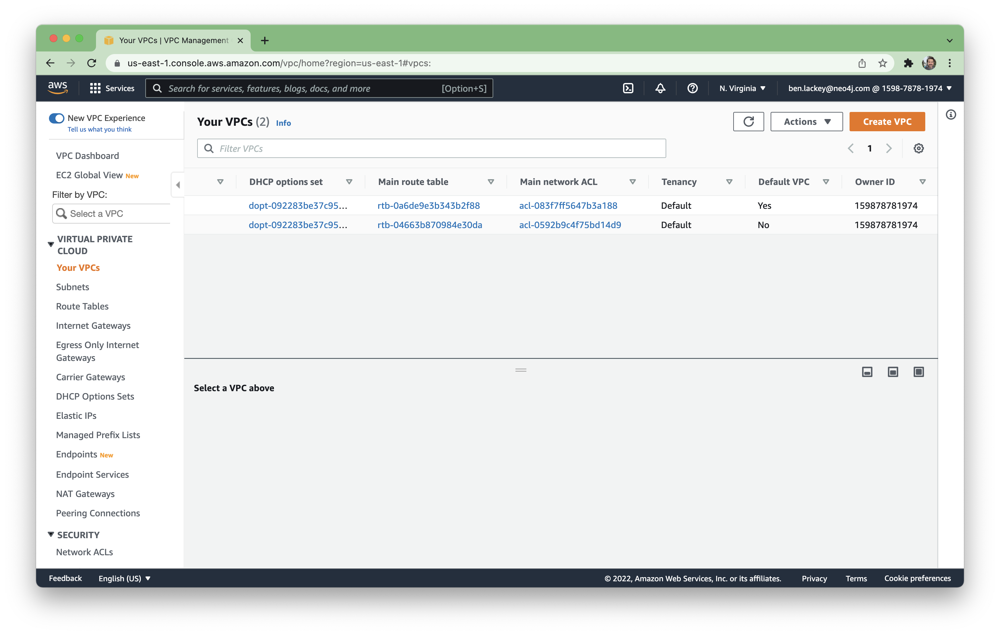

If you don't have a default VPC, you're going to need to create one.  Click "Create VPC" in the upper right.  If you do have a default VPC, then we should check a few more things.  Click on the default VPC.

In that view, check "DNS hostnames" is enabled and that "DNS resolution" is enabled.

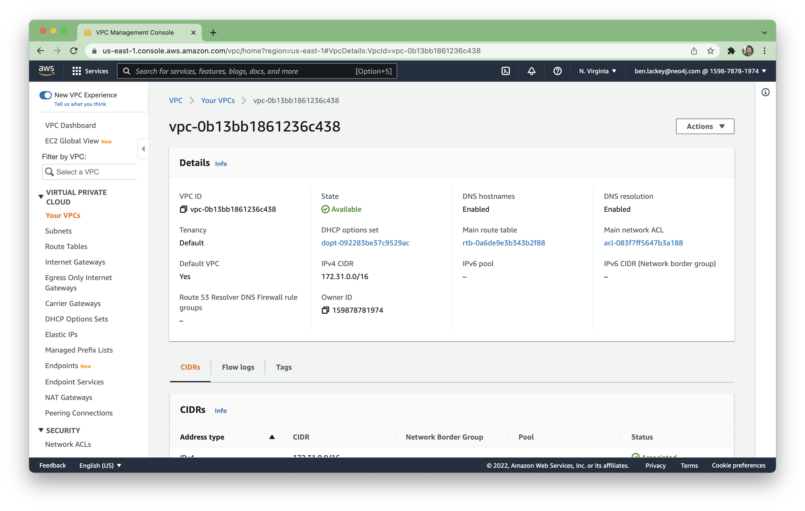

Finally, click "Subnets" in the menu on the left of the console.

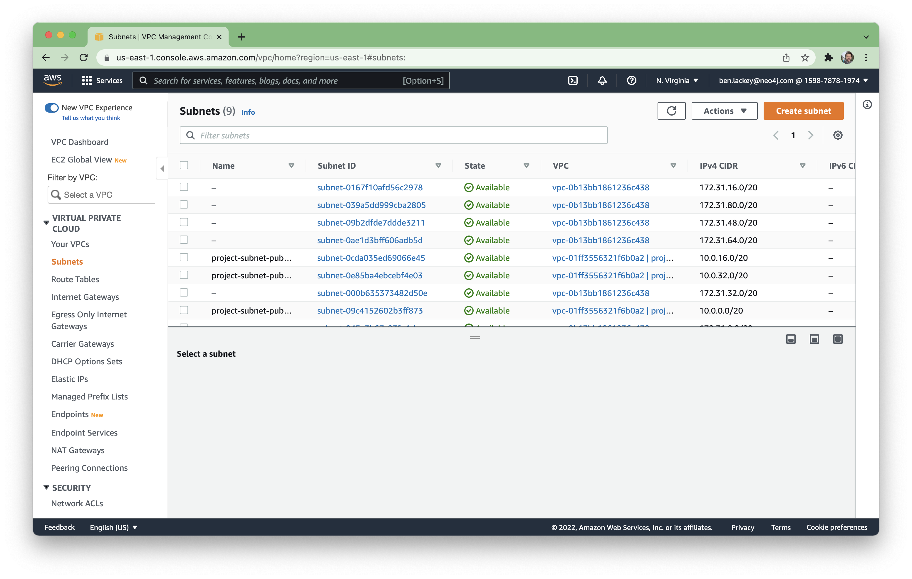

Scroll to the right and locate the subnets in your default VPC.  Those are the ones that say "Yes" under "Default subnet."  Make sure that "Auto-assign public IPv4 address" is "Yes."

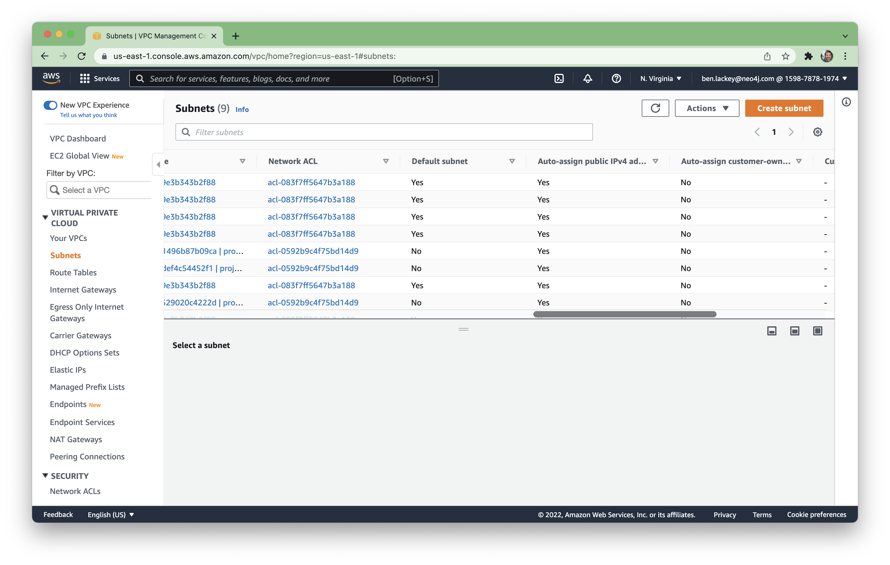

## Deploying Neo4j Enterprise through the Marketplace
Alright, we're all read to deploy Neo4j!  To do so, let's go to AWS Marketplace.  We could go to the Marketplace and search.  But, instead, let's go directly to the AWS Marketplace seller profile for Neo4j.  That's [here](https://aws.amazon.com/marketplace/seller-profile?id=23ec694a-d2af-4641-b4d3-b7201ab2f5f9).

On the seller profile page there are two options.  One is for Neo4j AuraDB Enterprise.  Aura is Neo4j's database as a service (DBaaS).  This is a software as a service (SaaS) offering.  The DB means this is the database version of Aura.  On AWS, there's an upcoming AuraDS, which is the data science version of Aura.

Instead of AuraDB Enterprise, we'll be using Neo4j Enterprise Edition.  That is the installable version of Neo4j.  The AWS listing has a Cloud Formation Template (CFT) that deploys Neo4j for you.  This has options to deploy Neo4j Graph Database, Neo4j Graph Data Science and Neo4j Bloom.

Graph Database is, as the name implies, Neo4j's core database.  It's designed from the ground up to store graphs.  This comes in both a community and an enterprise version.  We're going to use the enterprise version.

Graph Data Science (GDS) is the graph library that installs on top of the database.  It has implentations of 60 different graph algorithms.  We're going to use GDS to do things like create graph embeddings later in the labs.

Bloom is a business intelligence tool.  We'll install it as well and use it to explore the data.

So, let's get started deploying...  Click on "Neo4j Enterprise Edition."

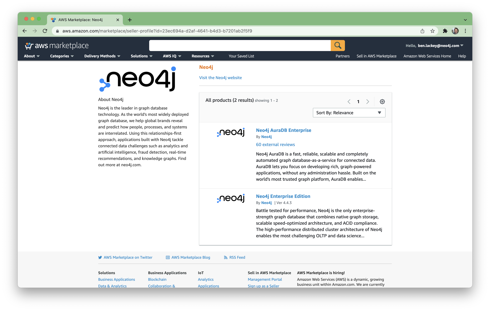

Feel free to poke around the listing.  Once you've read a bit, click "continue to subscribe."

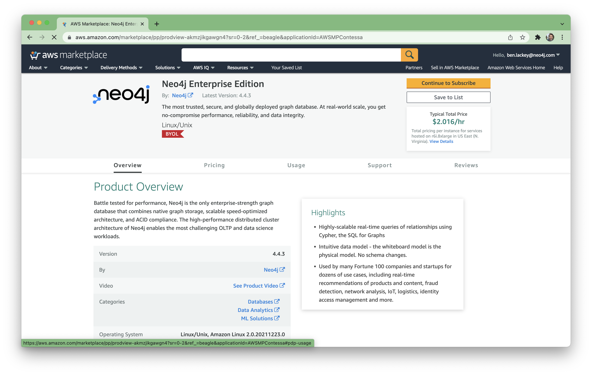

On that page, click "Accept terms."  What you're agreeing to here is esentially a 30 day trial of Neo4j Enterprise Edition.  You can click on the EULA link to read through the terms.

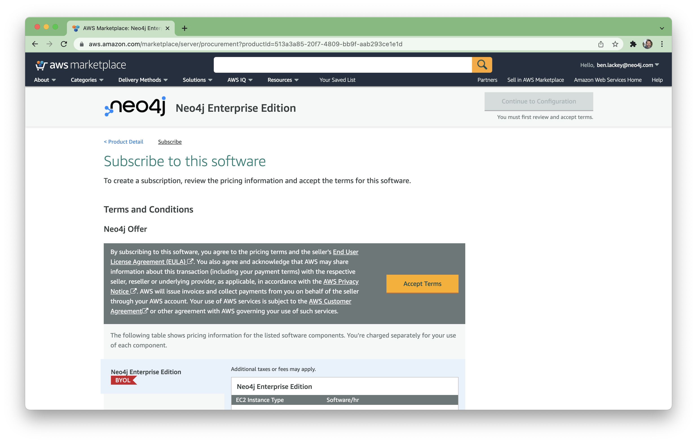

After you accept the terms, you see a spinning dialog with a message that it's "pending."  That'll take a few minutes to process.  Underneath the AWS platform is whitelisting you to deploy the listing.

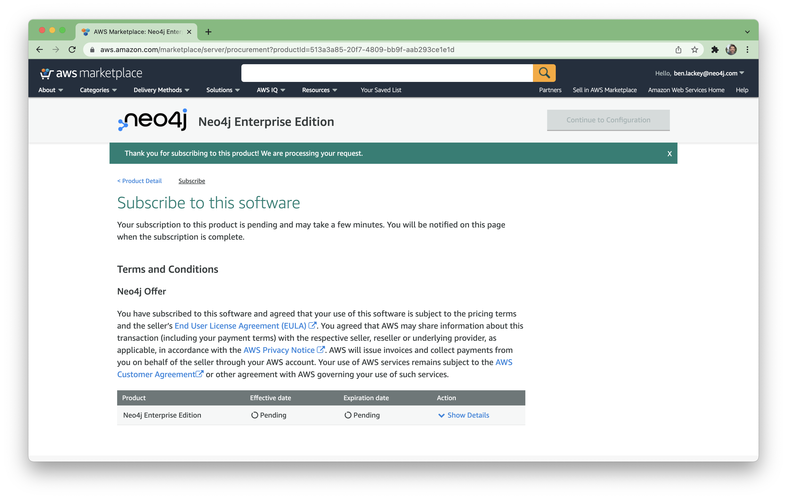

When the subscription is complete, there will be a button to "Continue to Configuration."  Click that.

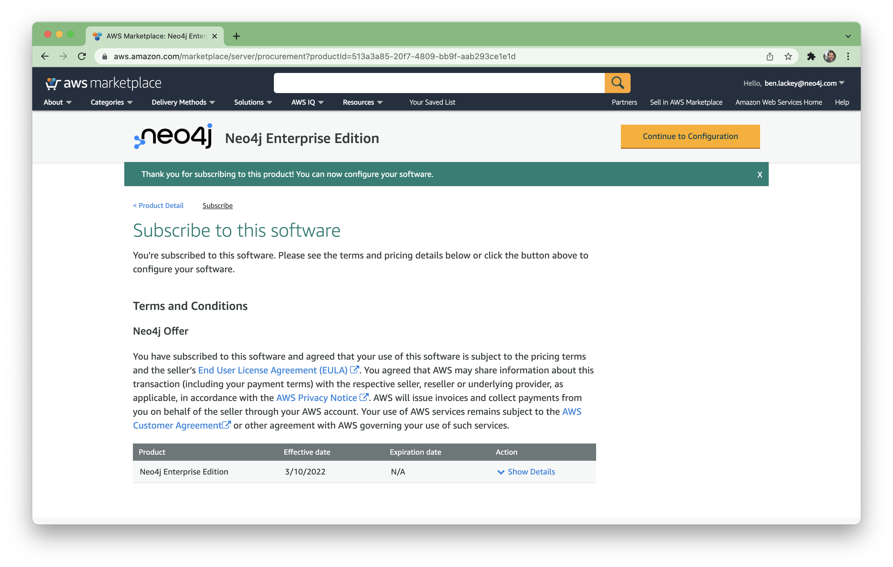

That takes you to a configuration page.  We can accept the defaults for that.  Check that the region is the same region your VPC and key pair were in.  If it is, click "Continue to Launch."

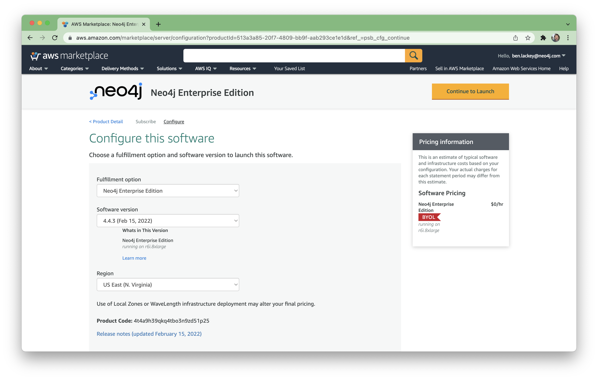

We now see the launch page. Go to the drop down for "Choose Action" and select "Launch CloudFormation."

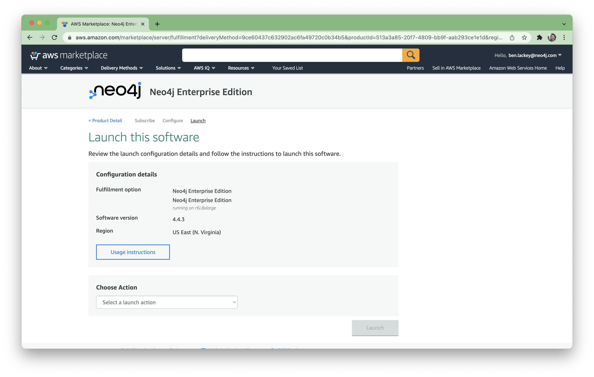

With that all set, the "Launch" button should turn yellow.  Click it.

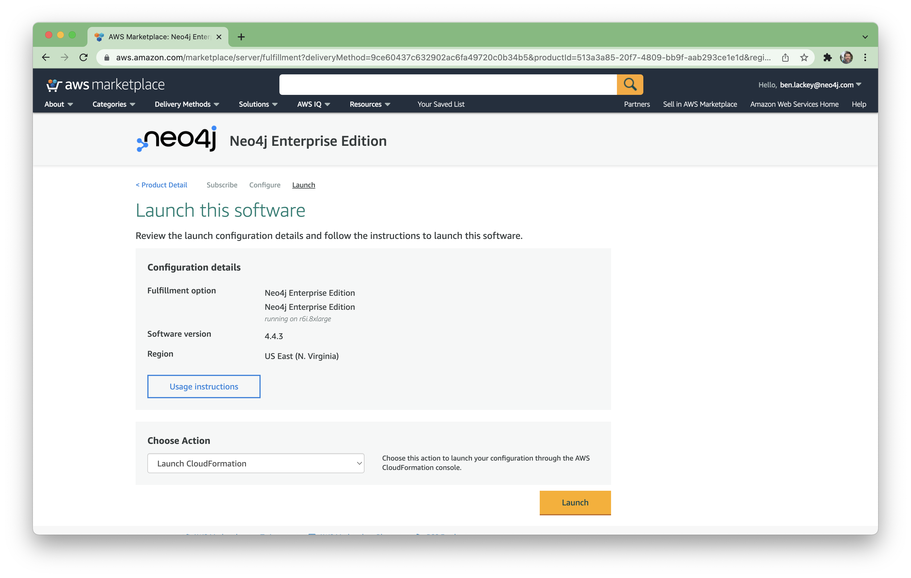

Assuming you're still logged into AWS from our earlier setup, you'll get directed into the AWS console.  This is the CloudFormation service.  CloudFormation is AWS's Infrastructure as Code (IaC) language.  It's analogous to technology like Terraform.  CloudFormation enables you to automate the deployment of AWS resources.

Because we clicked through from Marketplace, the CloudFormation conssole is already populated with the location of a template in an s3 bucket.  Click "View in Designer."

This directs us into the CloudFormation designer.  In the current view, we can't see anything.  Click the symbol above "+" to center the designer on our resources.

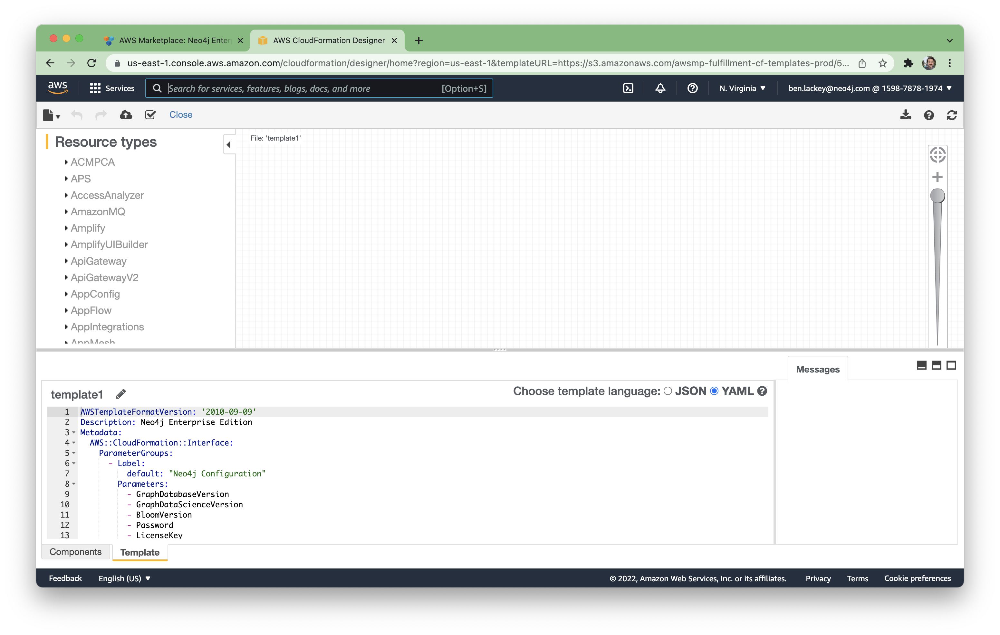

The view should now be centered on the resources to be deployed.  You can see that the template deploys two security groups.  One is external and one is internal.  The internal security group opens connectivity between nodes in the cluster to do things like replication.  The external one allows us to connect to the database from outside the VPC.  This makes it possible for us to navigate to the Neo4j Browser from our laptops.

The CFT creates a role that the CFT uses to setup Neo4j nodes.  It then creates three components of an autoscaling group:
* Launch Configuration
* Instance Template
* Auto Scaling Group

You can click on resosurces to learn more about them.  You can also view the raw Cloud Formation template.  When done, click the back button on your web browser.

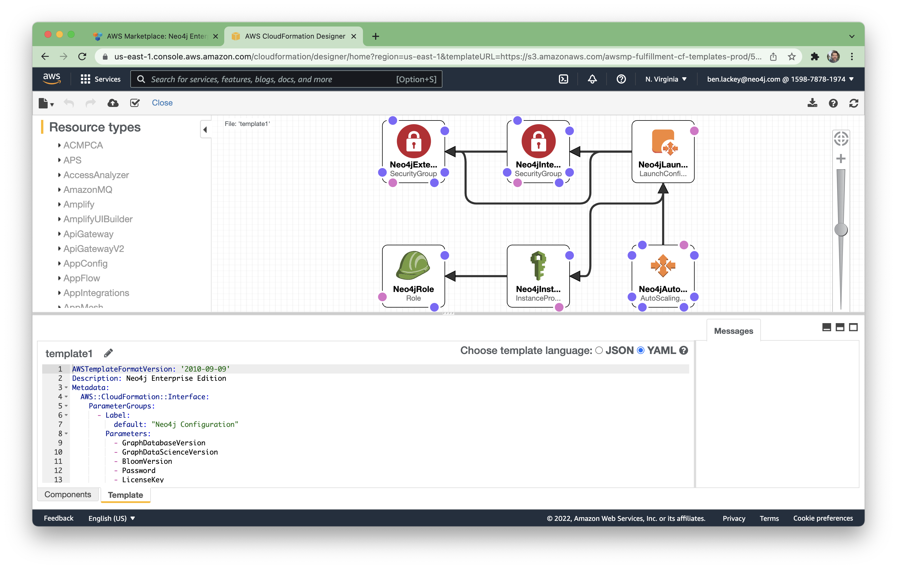

You'll be presented with a warning about unsaved changes.  We didn't make any changes, so it's fine.  Click "Leave."

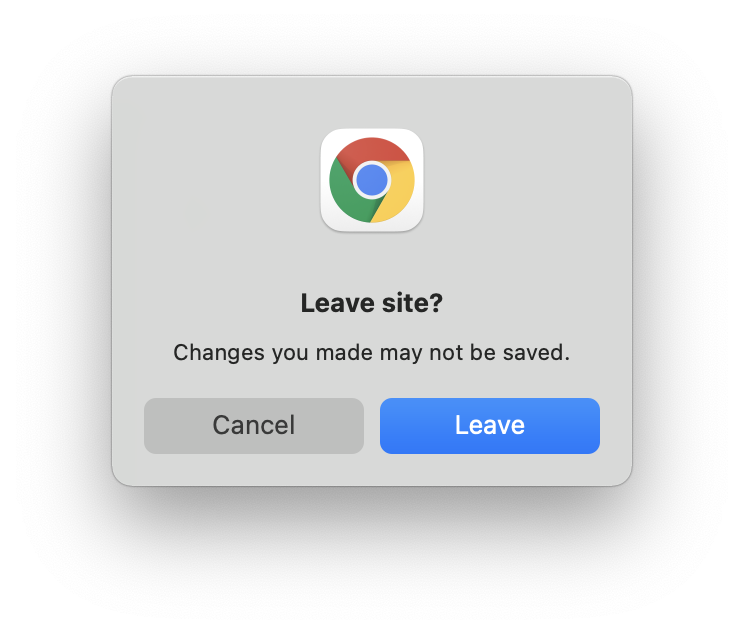

Now we're back at the CloudFormation console.  Since we have a good understanding what the template is going to deploy, let's scroll down and click "Next."

We're now at the stage where we need to make some choices about how we're deploying Neo4j.

For the stack name, type "neo4j-ee" and move to the next field.  For "Graph Database Version," just take the default.  For "Graph Data Science Version," select the newest version available.  The default value is "None," which means that GDS will not be installed by default.  If you don't change this value, GDS won't be installed and you won't have it available for later exercises.

For "Bloom Version," select the most recent version available.  The default value is "None," which means that Bloom will not be installed by default.  If you don't change this value, Bloom won't be installed and you won't have it available for later exercises.

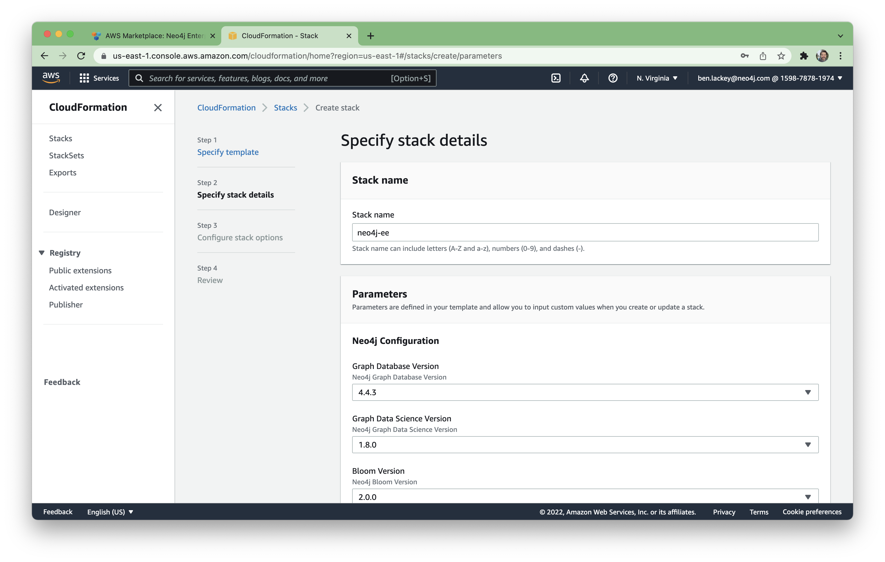

You need to select a password as well.  This should be six characters or longer.  My go to password is "foo123"

Enter the license key you were provided at the start of the lab.  Graph Database Enterprise does not require a license key.  Graph Data Science Enterprise does need a license key.  If you don't specify it, Graph Data Science will start in Community mode.  That means it will not have some features we're going to use later in the lab.  Bloom requires a license key and will not start unless you specify one.

For the "Node Count" select "1." This is the number of Neo4j nodes that will be deployed in the autoscaling group.  Because we're using GDS, we want a single node.  If we were using only GDB, we might deploy in a 3 node cluster for resilience.

Instance type and disk size can use the defaults.

For "Key Name," you'll want to select the key pair you created earlier, called "neo4j-sagemaker."

Finally, for the "SSH CIDR," you need to type "0.0.0.0/0" which is an oddball AWS Marketplace requirement.  If you specify any other value, you're not going to be able to connect to your Neo4j deployment.

With all that config specified, it's time to click the "Next" button.

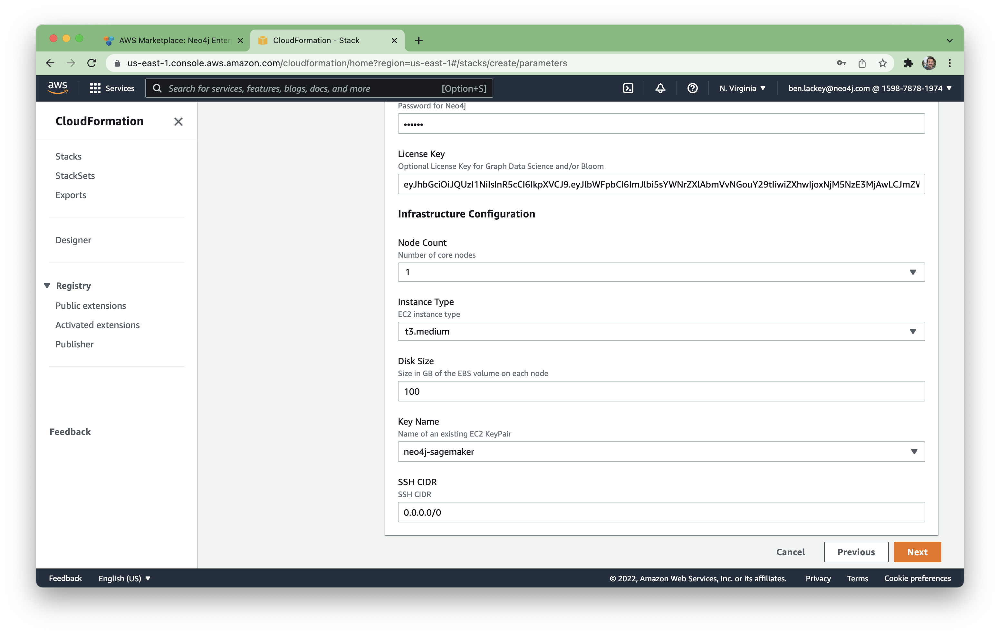

We can accept all the defaults here.  Scroll to the bottom here.

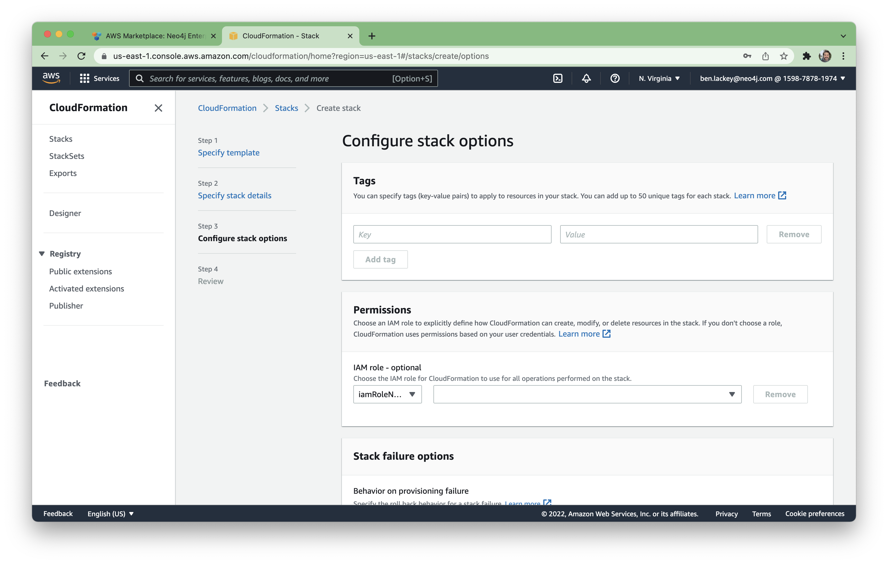

 Now click "Next."

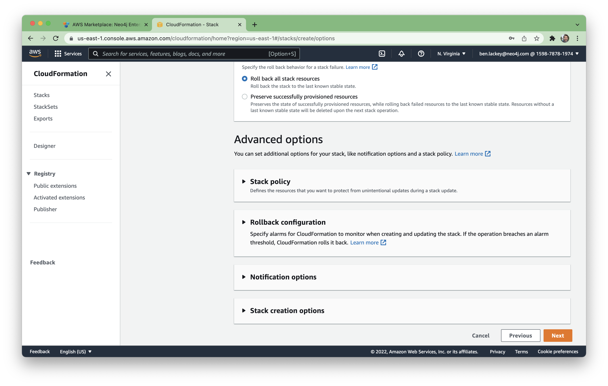

Now there's one final review page.  Assuming that all looks correct, scroll to the bottom.

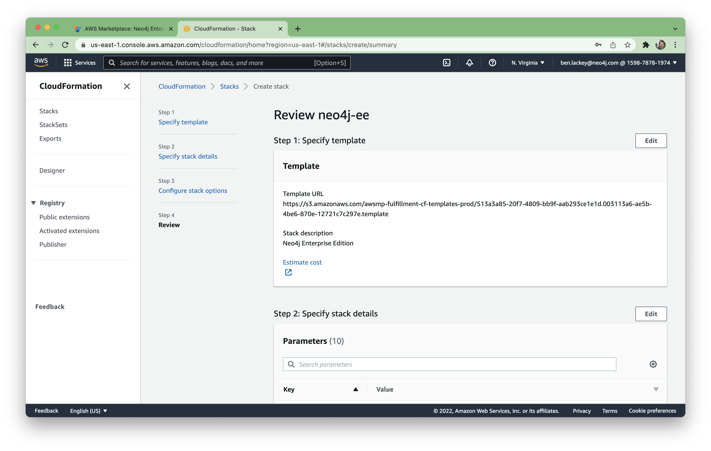

We're here!  Check "I acknowledge that AWS CloudFormation might create IAM resources" as that is, after all, the entire point of a Cloud Formation template.  Then click "Create stack."

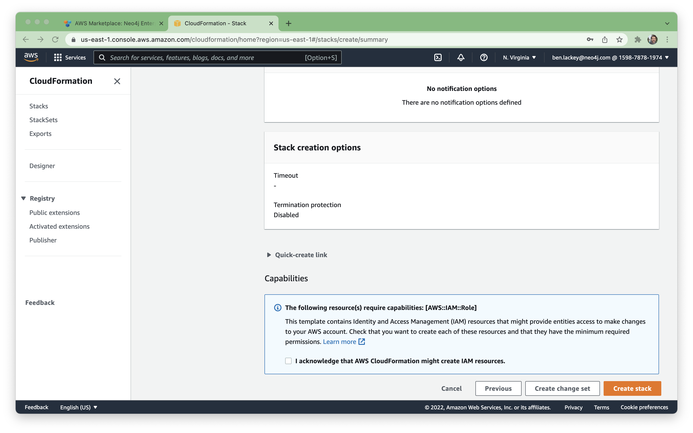

You'll now be redirected to a page where you can see the status of your stacks.  Deployment of this stack seem to take about three minutes.  

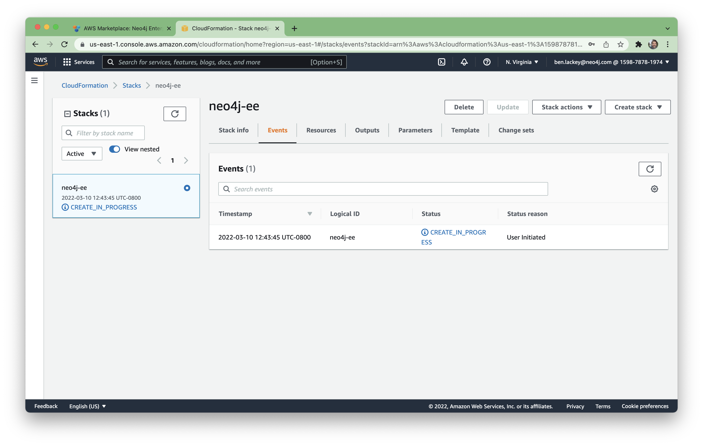

You can hit the refresh button or even click over to "Resources" to see how it's progressing.

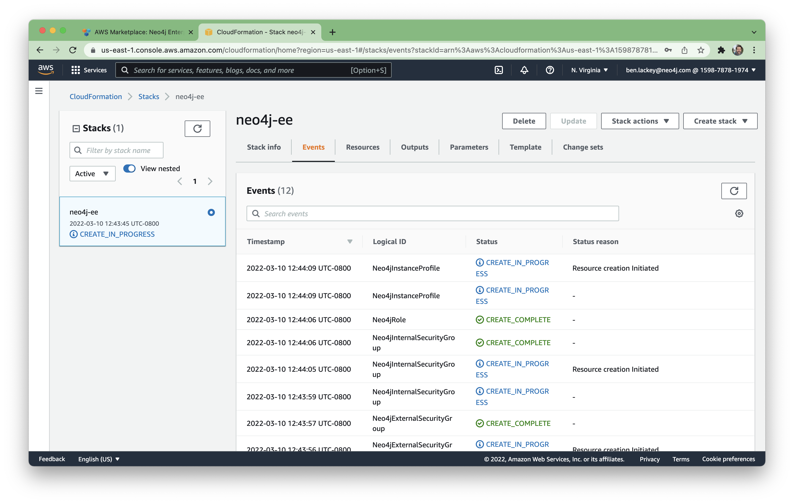

When all done, you'll see "CREATE_COMPLETE" in the stacks mennu on the left.

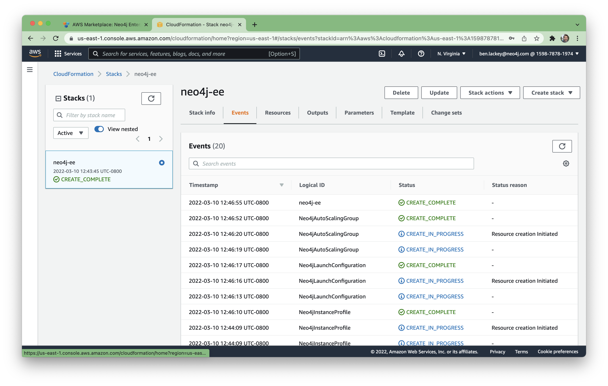

## Cloud Formation Template
In this lab we worked through deploying via the Marketplace.  The Marketplace is essentially a nice GUI around Cloud Formation.  If you're a more technical user and like deploying from the command line there are a variety of options.  These options are also useful if you'd like to modify the Cloud Formation template.

The first of these is the Neo4j Partners GitHub organziation.  That has a repo with the template from Marketplace as well as additional templates in it.  You can view that [here](https://github.com/neo4j-partners/amazon-cloud-formation-neo4j).

Additionally, Neo4j worked on a Quickstart with Amazon.  That is available [here](https://aws.amazon.com/quickstart/architecture/neo4j-graph-database/), though the code underlying the Quickstart is on GitHub [here](https://github.com/aws-quickstart/quickstart-neo4j/).
