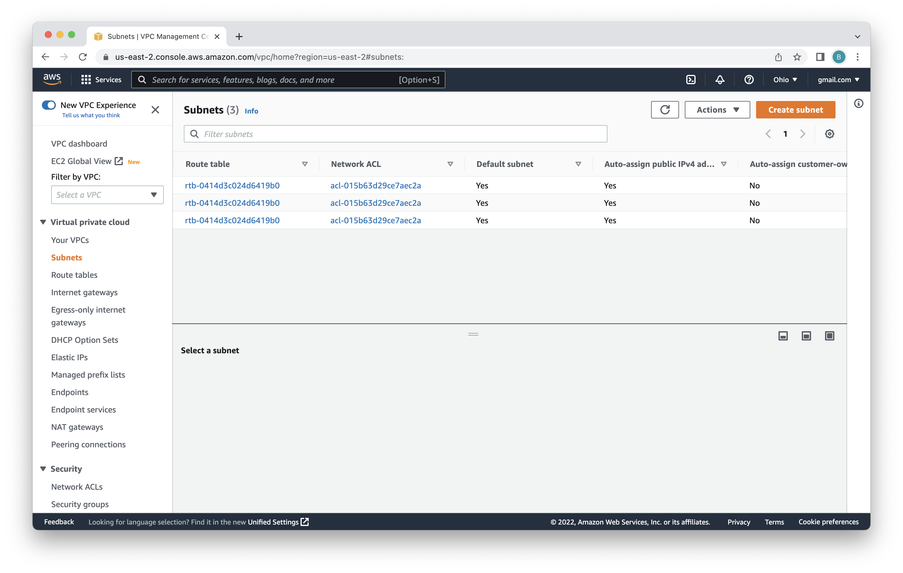

# Lab 1 - Deploy Neo4j
In this lab, we're going to deploy Neo4j Enterprise Edition from the AWS Marketplace.  That listing has a Cloud Formation template under it that we'll inspect.  We'll also look at more customizable deployment options.

## Sign up for AWS
The most basic thing you're going to need for these labs is an AWS account.  If you don't have an account yet, you can sign up for one [here](https://aws.amazon.com/).

You'll need to provide your phone number and credit card information.  Total costs for the lab should be significantly under $50.  At the end of the lab we'll show you how to delete any resources you've deployed as well.

## Apply AWS Credits
As part of the labs, AWS is providing credits.  The credits should far exceed the cost of resources consumed during this lab.  You can apply the credits to your account by navigating [here](https://console.aws.amazon.com/billing/home?#/credits)

Once there, click on "redeem credit."

You'll then need to enter the code for the credit and answer the captcha.  With that complete, click "Redeem credit."

## Pick a Region
For this lab, you'll want to pick one AWS region to put all your resources in.  It doesn't particularly matter which region you use.  That said, if you use the default region for your account, things will probably be simpler.  You can tell which region is selected by looking in the upper right of the AWS console [here](https://console.aws.amazon.com/).  In the image below, the region is N. Virginia, also known as us-east-1.

Whatever region you select, make sure that you're logged into it as you proceed through the following steps.

## Create a Key Pair
The machine we're going to create for the lab will be an EC2 instance.  We'll need to create a key pair to connect to the instance.

If you don't have a key pair already, follow through these steps.  First, navigate to the console [here](https://console.aws.amazon.com/).  

Now, type "Key pairs" in the search bar at the top of the console.  Click on the "key pairs" result that shows up under "Features."

In this window, you'll see a list of existing key pairs.  Unless you have an old key pair that you want to use, you should click "Create key pair" in the upper right.

This menu is for creating the key pair.  For a name, type neo4j-sagemaker.  All the other defaults will work.  So, accept those and click "Create key pair."

That leads us back to our list of key pairs.  You can see the newly created key paid.  In my case, I'm using Chrome on a mac.  The private key was automatically downloaded to my ~/Downloads folder.  You can see it in the lower left of the browser.

In order to connect to the instance later, we'll need the private key in the path for our SSH client.

On a mac you can open a terminal and run these commands to move the key and then set the permissions:

    mv ~/Downloads/neo4j-sagemaker.pem ~/.ssh/
    chmod 400 ~/.ssh/neo4j-sagemaker.pem

That's it!

## Configure VPC
AWS accounts are created with a default VPC.  We're going to be using that for this deployment.  Sometimes people delete the default VPCs in their accounts.  Let's check and make sure the default VPC exists and is properly configured.  To do that, open an AWS console [here](https://console.aws.amazon.com/).

Type "VPC" in the search bar and select "VPC" under services.

In the VPC menu, select "VPCs."

That will give us a view of our VPCs.  With any luck, you'll already have at least one.  In my case, I have two.

Now scroll to the right of the VPC view and check if one of the VPCs has the value "Yes" under "Default VPC."  

If you don't have a default VPC, you're going to need to create one.  Click "Create VPC" in the upper right.  If you do have a default VPC, then we should check a few more things.  Click on the default VPC.

In that view, check "DNS hostnames" is enabled and that "DNS resolution" is enabled.

Finally, click "Subnets" in the menu on the left of the console.

Scroll to the right and locate the subnets in your default VPC.  Those are the ones that say "Yes" under "Default subnet."  Make sure that "Auto-assign public IPv4 address" is "Yes."

## Deploying Neo4j Enterprise through the Marketplace
Alright, we're all read to deploy Neo4j!  To do so, let's go to AWS Marketplace.  We could go to the Marketplace and search.  But, instead, let's go directly to the AWS Marketplace seller profile for Neo4j.  That's [here](https://aws.amazon.com/marketplace/seller-profile?id=23ec694a-d2af-4641-b4d3-b7201ab2f5f9).

## Cloud Formation Template
asd

## Graph Database
asd

## Graph Data Science
ads

## Bloom
asd