# Lab 1 - Deploy Neo4j
Neo4j has three major products:
* Graph Database - a native graph database built from the ground up to leverage not only data but also the relationships in that data
* Graph Data Science - implementations of 70+ algorithms that can be run on graphs stored in the database
* Bloom - a Business Intelligence (BI) tool designed specifically to explore graphs

There are many ways to run these products on AWS.  The Marketplace in particular offers two ways to deploy Neo4j:

* Software as a Service (SaaS) - Neo4j Aura is the lowest effort way to deploy Neo4j.  Infrastructure is managed entirely for you.  Aura is available in AuraDB (Database) and AuraDS (Data Science) versions.  DB is the core database.  DS includes Bloom for Business Intelligence and Neo4j Graph Data Science.
* Infrastructure as a Service (IaaS) - Neo4j Enterprise Edition is available on IaaS with an AWS CloudFormation Template (CFT).  That allow you to choose whether you would like a single node or cluster.  It allows deployment of Graph Database, Bloom and Graph Data Science.

## Deploying AuraDS Professional
We're going to use the SaaS version, AuraDS, in these labs.  This is sometimes refered to as a database as a service (DBaaS).  Aura comes in a number of flavors.  There's an enterprise and a professional version.  We're going to deploy the professional version.  

So, let's get started deploying...  To do so, let's open the seller profile [here](https://aws.amazon.com/marketplace/seller-profile?id=23ec694a-d2af-4641-b4d3-b7201ab2f5f9).

Scroll down and select "Neo4j Aura Professional."

Note that this account has already been subscribed to Neo4j Aura Professional.  Click on "Click here to set up your account."

This takes us to the Neo4j Aura console.  Billing information has been passed over from the AWS account we just came from.  Under "Don't have an account" click "Sign up."

You'll need to enter an email address.  Alternatively you can authenticate with Google.  In my case, I'm entering my personal address.

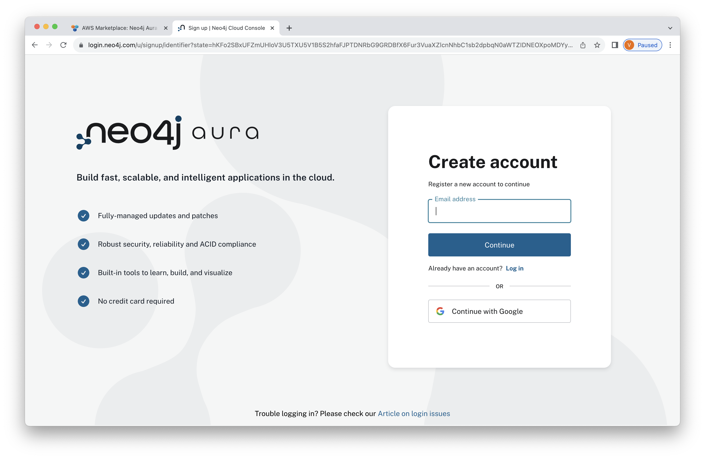

Now enter a password.  Be sure to remember it.  Click "Continue."

You'll now be asked to verify your email address.  Open your email client and view the verification email.

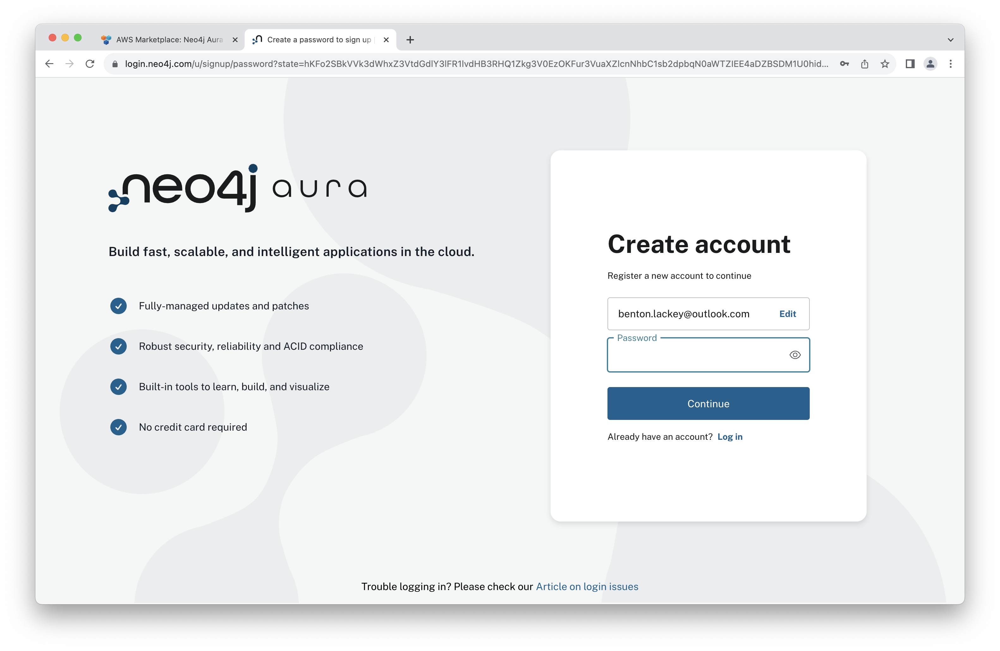

Click "Verify me e-mail address."

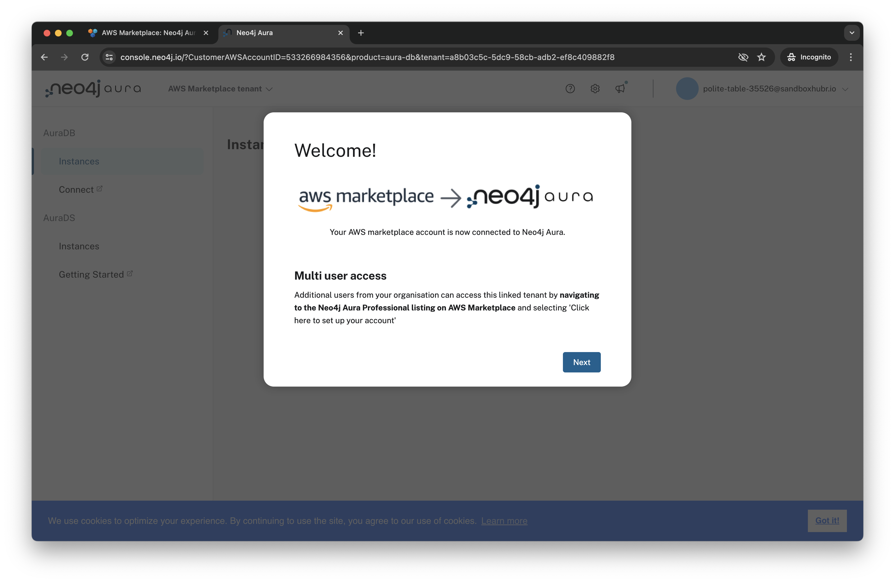

You should see a message that your address was verified.  Go back to the window with the Neo4j Aura console.

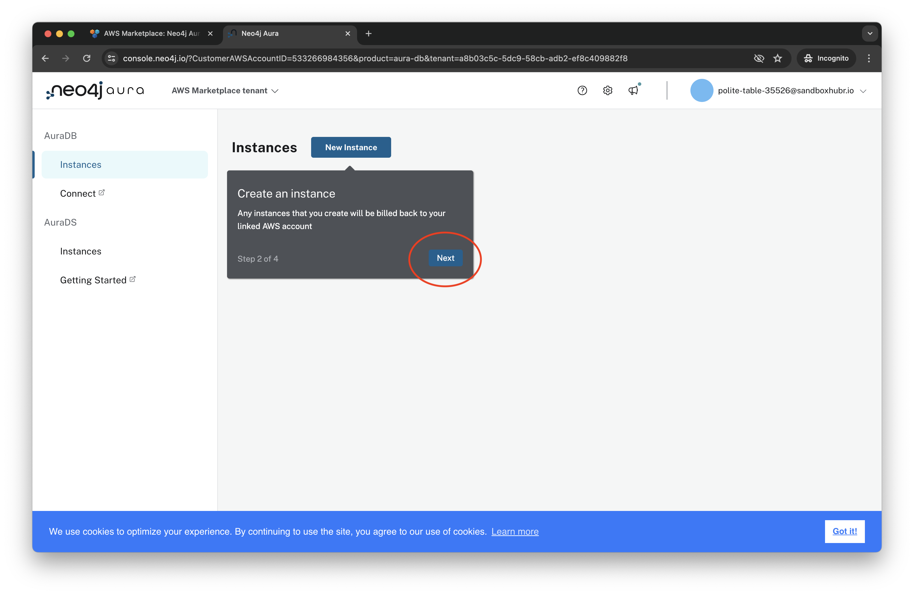

Click your name in the upper right.  In that dialog click "Log out."

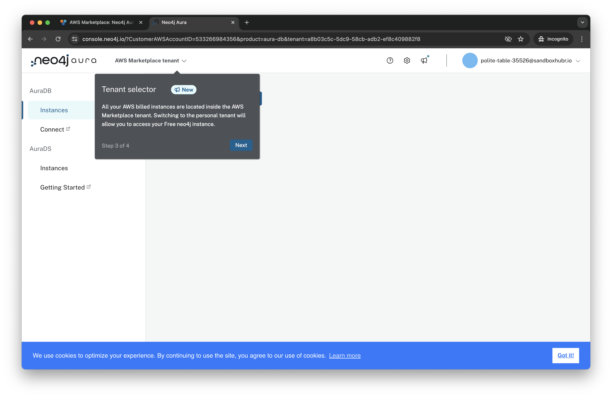

Now, back a the login screen, click "Log in."

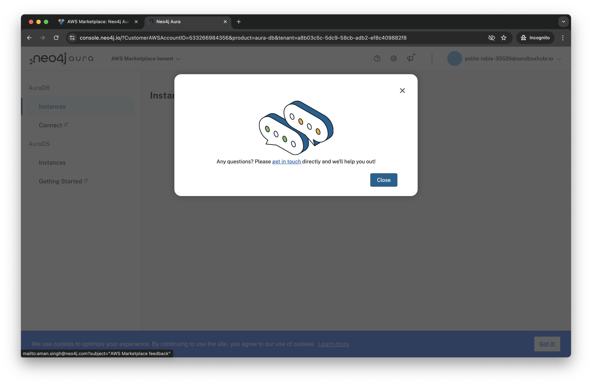

Enter your password and click "Log in."

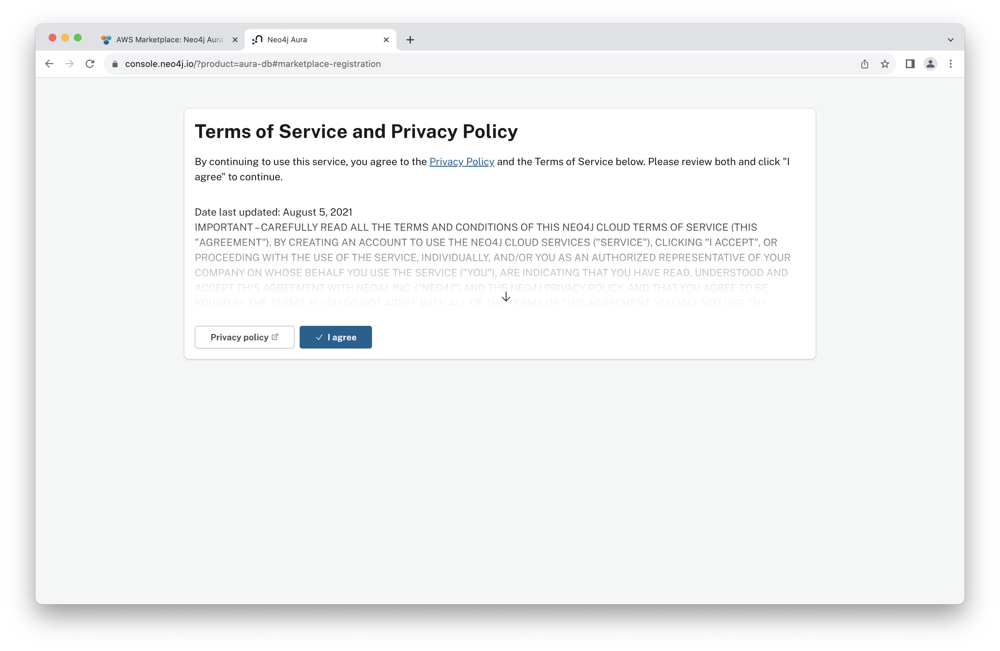

Click "I agree" to agree to terms.

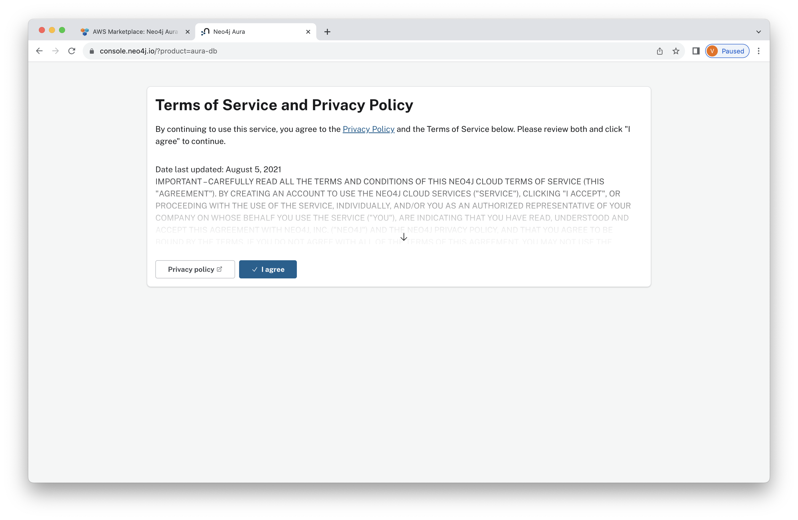

In the menu on the left click on "Instances" under "Aura DS."  Important -- be absolutely certain to select AuraDS.  It has components like Graph Data Science that AuraDB does not.  We're going to need those later.

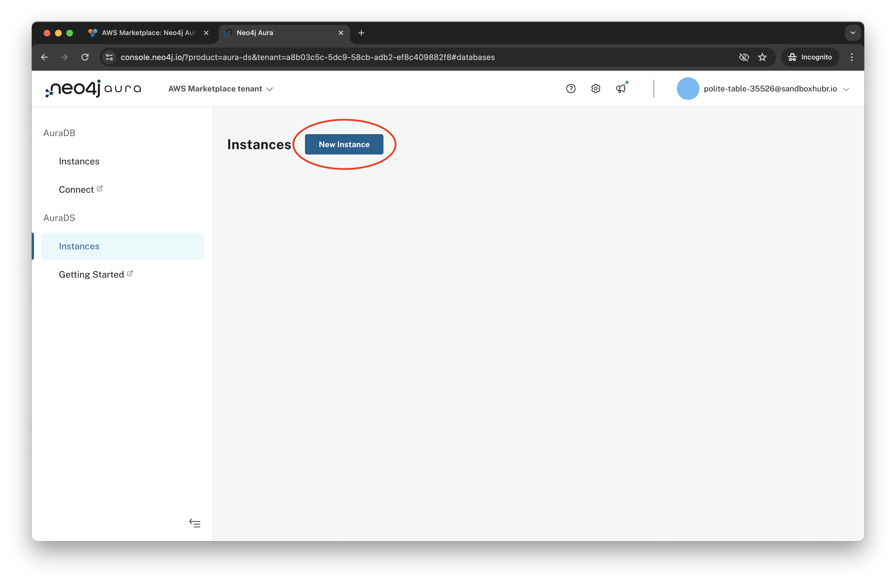

Click "New instance."

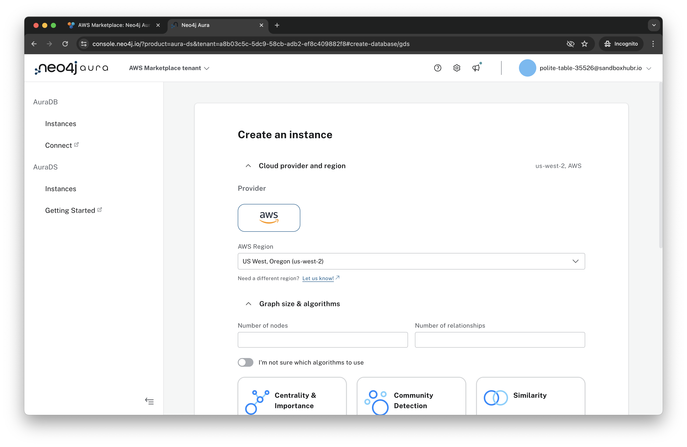

Select the AWS logo.  For "Number of nodes" enter 500,000.  For number of relationships, enter "1,000,000."  This will ensure our AuraDS deployment is of sufficient size for our workload.  

For algorithms select "Node Embedding."  This item doesn't change the config, rather is a survey of what algorithms users are making use of.

With all that done, click "Calculate Estimate."

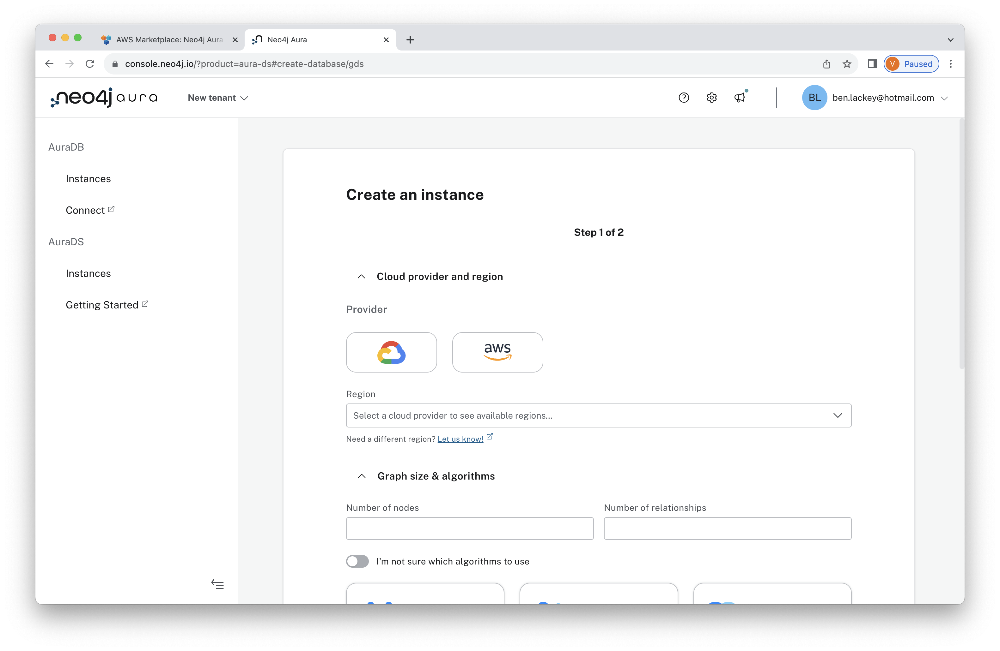

For instance name, let's put "sec-edgar."  Click "Next."

Hmmmm.  Payment method didn't get passed through for some reason.

To do.....

You'll be presented with the credentials for your database.  Click "Download and continue."  That will download the credentials to a text file on your local machine.  Be sure to save that file as you won't be able to get those credentials later.

You'll see a dialog that your database is being created.  This takes less than five minutes.

When deployment is complete you'll see this menu.  

You can poke around the menus here a bit and see more on database status and connection information.

You now have a deployment of Neo4j running!  In the next lab, we'll connect to it.
