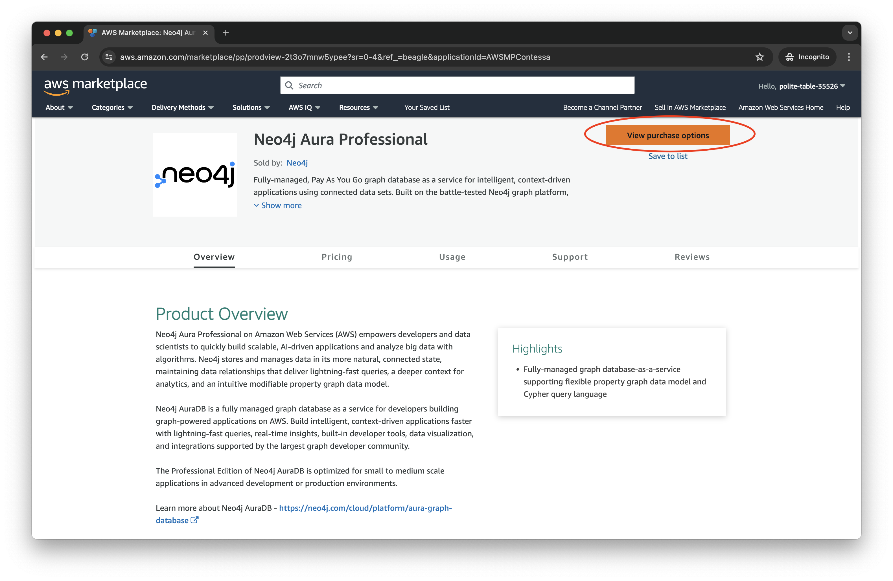
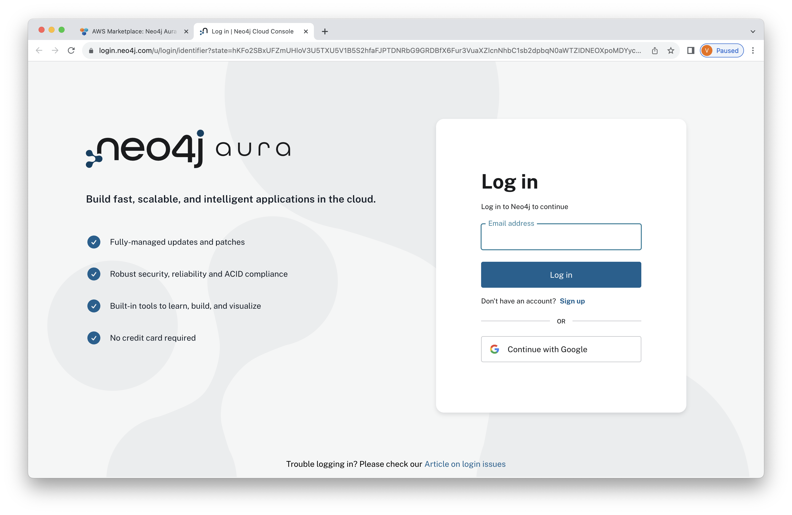
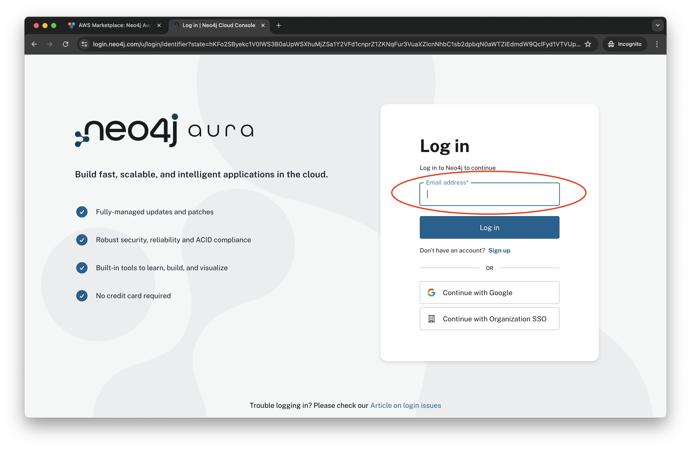
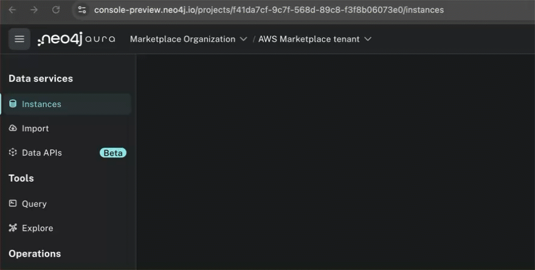
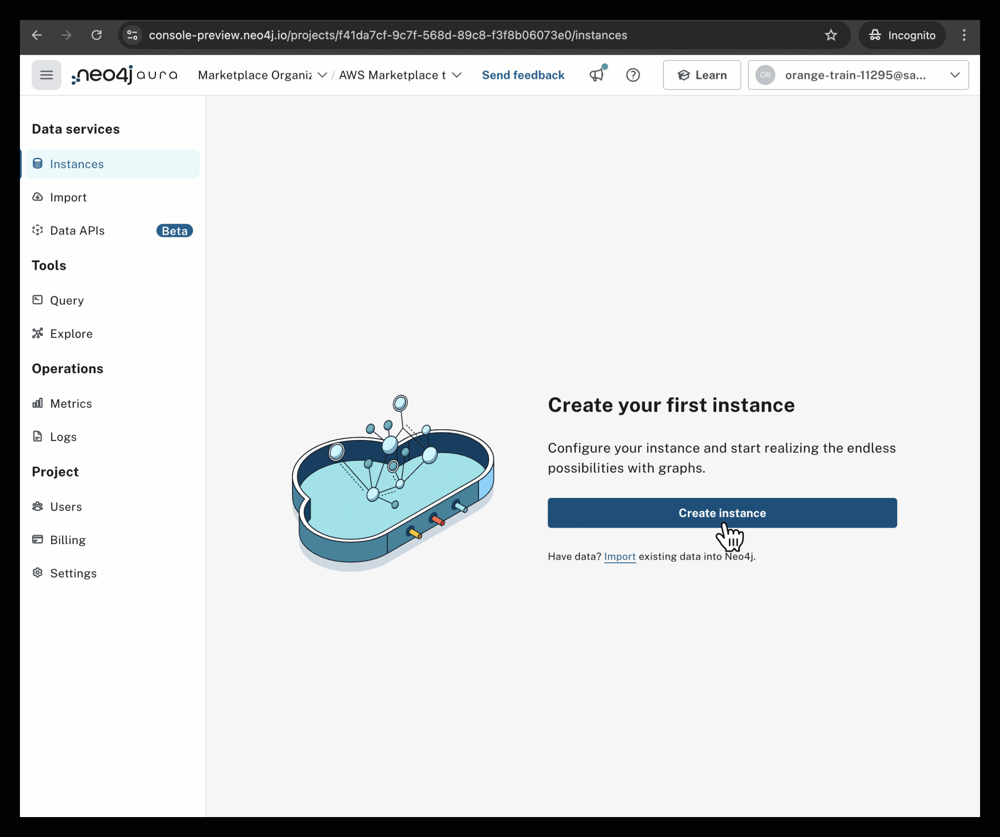
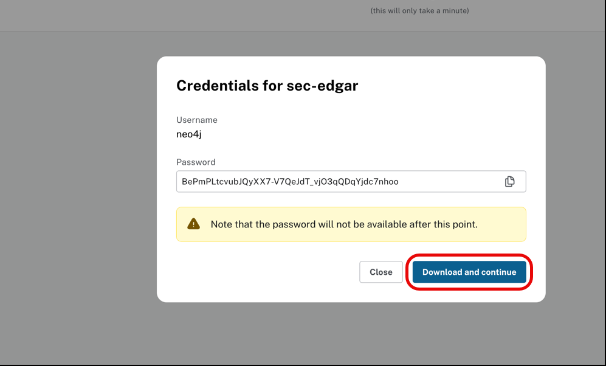
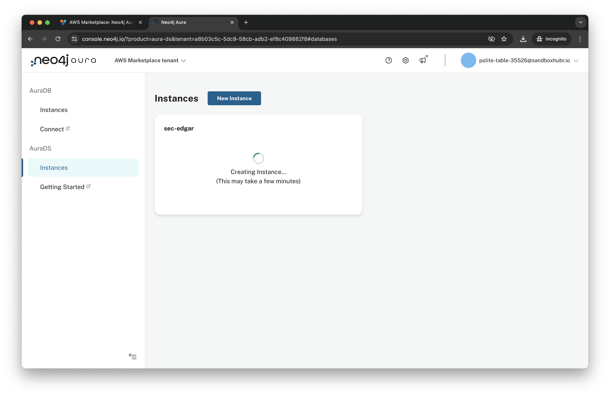
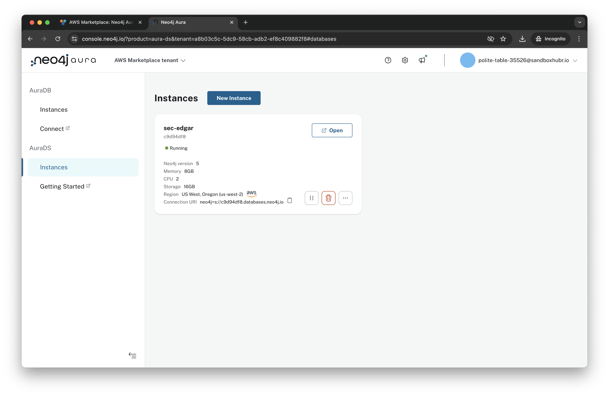

# Lab 1 - Deploy Neo4j
Neo4j has three major products:
* Graph Database - a native graph database built from the ground up to leverage not only data but also the relationships in that data
* Graph Data Science - implementations of 70+ algorithms that can be run on graphs stored in the database
* Bloom - a Business Intelligence (BI) tool designed specifically to explore graphs

There are many ways to run these products on AWS.  The Marketplace in particular offers two ways to deploy Neo4j:

* Software as a Service (SaaS) - Neo4j Aura is the lowest effort way to deploy Neo4j.  Infrastructure is managed entirely for you.  Aura is available in AuraDB (Database) and AuraDS (Data Science) versions.  DB is the core database.  DS includes Bloom for Business Intelligence and Neo4j Graph Data Science.
* Infrastructure as a Service (IaaS) - Neo4j Enterprise Edition is available on IaaS with an AWS CloudFormation Template (CFT).  That allows you to choose whether you would like a single node or cluster.  It allows deployment of Graph Database, Bloom and Graph Data Science.

## Deploying AuraDS Professional (pay-as-you-go)
We're going to use the SaaS version, AuraDS, in these labs.  This is sometimes refered to as a database as a service (DBaaS).  Aura comes in a number of flavors.  There's an enterprise and a professional version.  We're going to deploy the professional version.  

So, let's get started deploying...  To do so, let's open [the seller profile](https://aws.amazon.com/marketplace/seller-profile?id=23ec694a-d2af-4641-b4d3-b7201ab2f5f9).

Scroll down and select "Neo4j AuraDB Professional (pay-as-you-go)."

Click "View purchase options."

Note that this account has already been subscribed to Neo4j Aura Professional.  Click on "Vendor's website"

This takes us to the Neo4j Aura console.  Billing information has been passed over from the AWS account we just came from. Enter the Neo4j Aura credentials: the Neo4j Username and Neo4j Password provided on the OneBlink page, and click "Log in." 

**NOTE: Be sure the "AWS Marketplace" tenant is selected from the dropdown menu on the upper left side of the screen**

Follow these steps to create a new instance in **Neo4j AuraDS**:

1. Click **"Create Instance"**  
2. Select **AuraDS** from the right-hand corner  
3. Choose **AuraDS** and keep the default instance size  
4. Enter **`sec-edgar`** as the instance name  
5. Check the box next to **"I Accept"**  
6. Click **"Create"**  

You'll be presented with the credentials for your database.  Click "Download and continue."  That will download the credentials to a text file on your local machine.  Be sure to save that file as you won't be able to get those credentials later.

You'll see a dialog that your database is being created.  This takes less than five minutes.

When deployment is complete, you will see an instance with the status 'Running,' as shown below.  

You can explore the Neo4j Aura console to view metrics, import data into your database, check logs, and more.

You now have a deployment of Neo4j running!  In the next lab, we'll connect to it.

#### Progress:  █░░░░░░ 1/7 Labs Completed!

