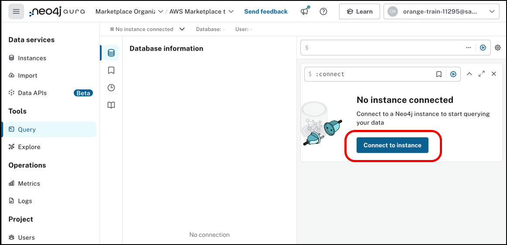
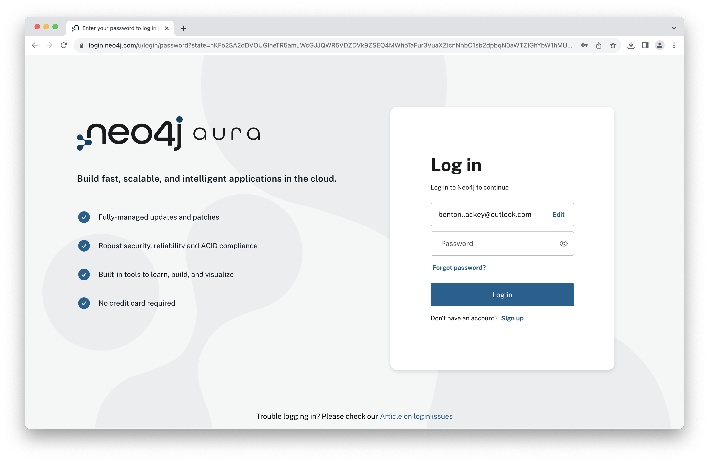
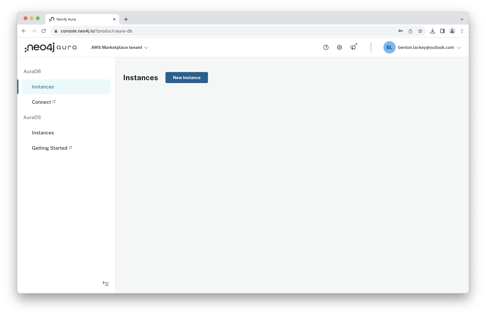
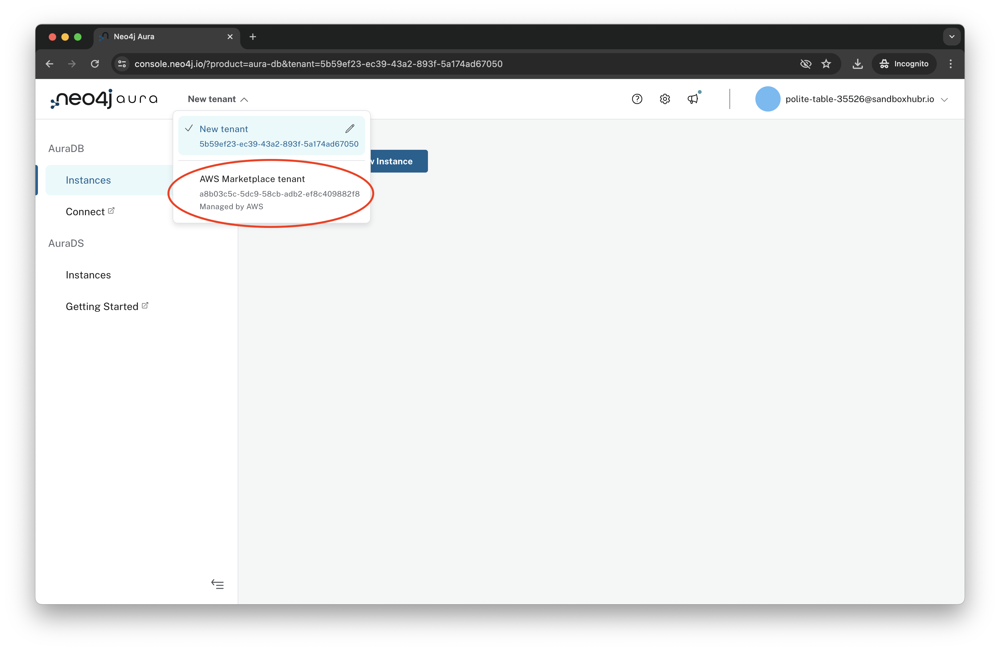
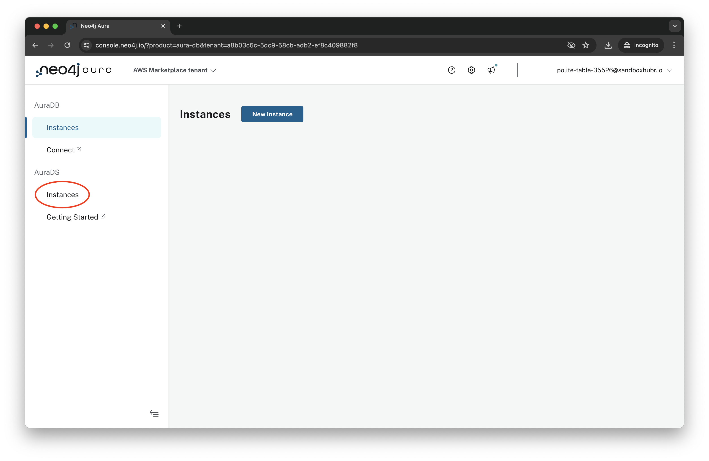
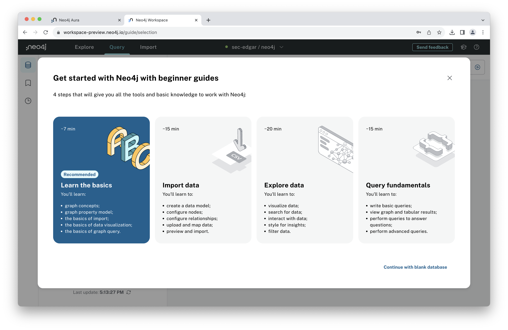
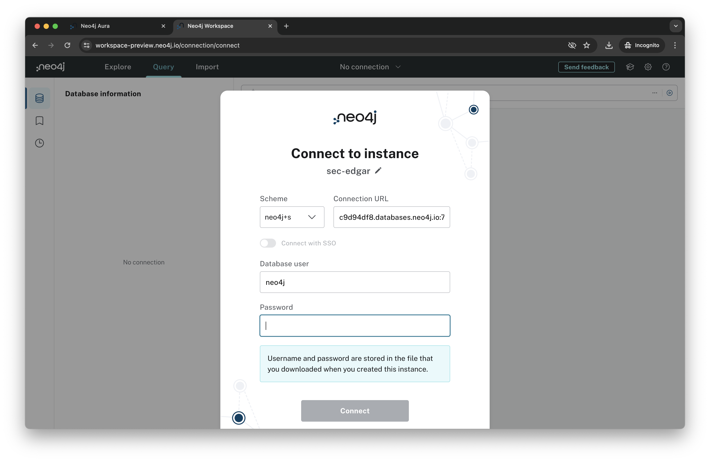
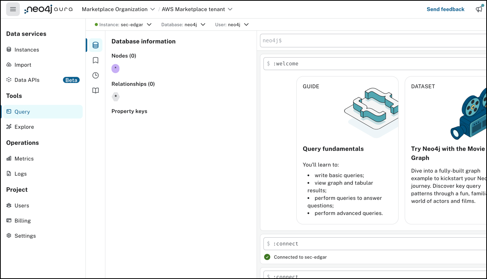
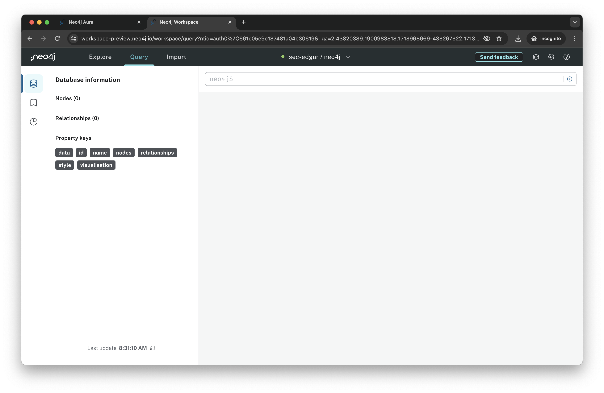
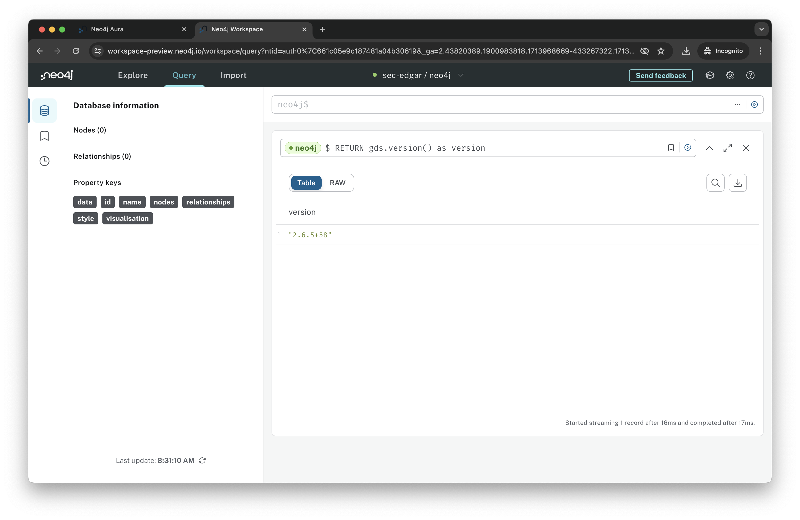

# Lab 2 - Connect to Neo4j
In this lab, we're going to connect to the Neo4j deployment we created in the previous step.  To get started, open the Neo4j Aura console by navigating [here](https://console.neo4j.io/).

Enter the email address for Neo4j Aura from your OneBlink.ai credentials and click "Log in."

Enter your password and click "Log in."

You should now see the Neo4j Aura console.

Select the "New tenant" from the tenant menu on the top of the screen.

Select the "AWS Marketplace tenant."

Click on "Instances" under AuraDS.

Click "Open" on the "sec-edgar" instance we previously deployed.

Click "Accept" to accept the terms.

You'll now need to provide your password.  You can find that in the file we downloaded earlier.  In my case, the file was named Neo4j-c9d94df8-Created-2024-04-24.txt.  It contained this content:

    # Wait 60 seconds before connecting using these details, or login to https://console.neo4j.io to validate the Aura Instance is available
    NEO4J_URI=neo4j+s://c9d94df8.databases.neo4j.io
    NEO4J_USERNAME=neo4j
    NEO4J_PASSWORD=b99a-656Mjq9CBns6rRqOXX05L9e5Cx1uOd1xgL6dg
    AURA_INSTANCEID=c9d94df8
    AURA_INSTANCENAME=sec-edgar

The password was then b99a-656Mjq9CBns6rRqOXX05L9e5Cx1uOd1xgL6dg

The standard NEO4J_USERNAME is neo4j.  All the other fields are unique to your database, including the NEO4J_URI.

Enter your password and click "Connect."

Note that the connection to the database is being made over port 7687.  If you have a firewall running on your laptop, or a VPN, it's quite possible that will block this connection.  To continue you will need to disable that.

Click "X" to dismiss the beginner guides.

We're now in Neo4j Workspace, a unified experience for working with graph data.  There are a number of tabs:

1. Explore - This will open Neo4j Bloom, the business intelligence tool.
2. Query - This will open Neo4j Browser, a tool where we can run database queries and inspect the results.
3. Import - This opens the Neo4j Data Importer, a graphical tool for importing data into Neo4j.

Let's start with Query aka Neo4j Browser.  It should already be open.

There's nothing in our database yet.  We can see the nodes, relationships and property key areas are all blank.

Cypher is Neo4j's query language.  Let's now run our very first Cypher command.  It will be a system command...

We can check what version of Neo4j Graph Data Science (GDS) is set up.  We can do that by entering the following command into the Neo4j the query field:

    RETURN gds.version() as version

Now click the run button, a triangle surrounded by a circle to run that command.

You should see a GDS version number.

Since we got a Graph Data Science version back, we know that we're on AuraDS, not AuraDB.  This means that we have the libraries we'll need to connect with the Python client and use graph algorithms later in these labs.

Assuming that all looks good, let's move on...
