# Lab 5 - Parsing Data
In this lab we're going to spin up a SageMaker domain.  We'll then use it to run a notebook that calls Neo4j and Amazon Bedrock APIs to load data into Neo4j.

## Create a SageMaker Domain
The first step is to deploy a SageMaker domain.  To do that, open the AWS console [here](https://console.aws.amazon.com/).  In the search bar, type "sagemaker." 

From the search results, click on "SageMaker Studio" under "Top Features".

Click the "Studio" link on the panel on the left.

Now click the "Domains" link on the panel on the left under `Admin Configurations`.

If you don't see a domain created already, click "Create Domain"
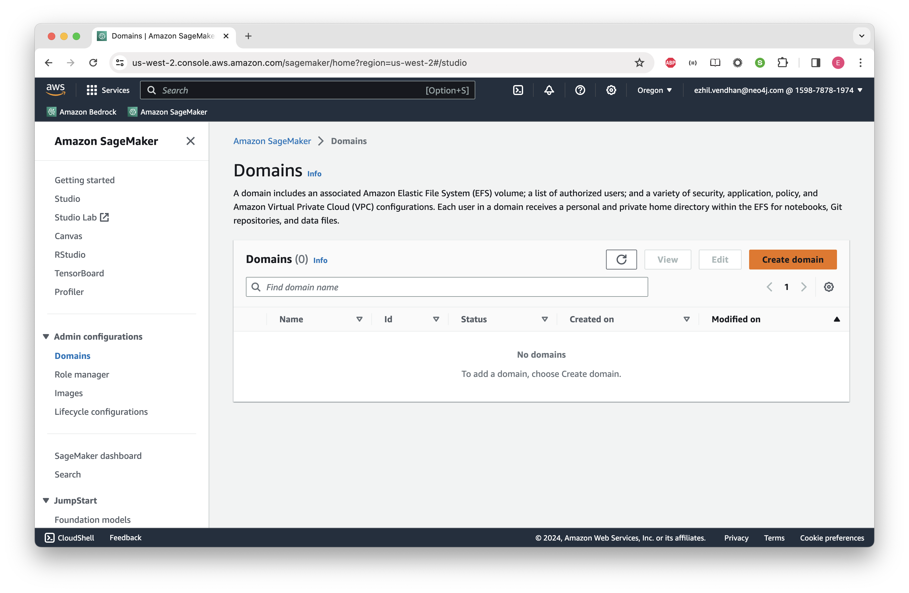

Click "Set up" in the Set up Sagemaker Domain page
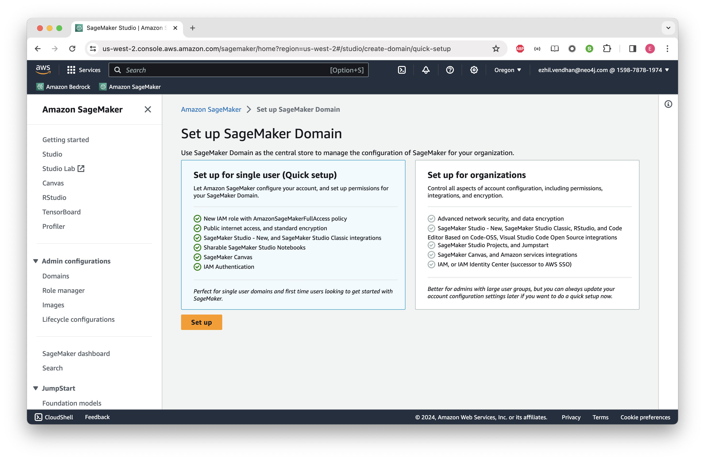

You will see the domain being created as below.
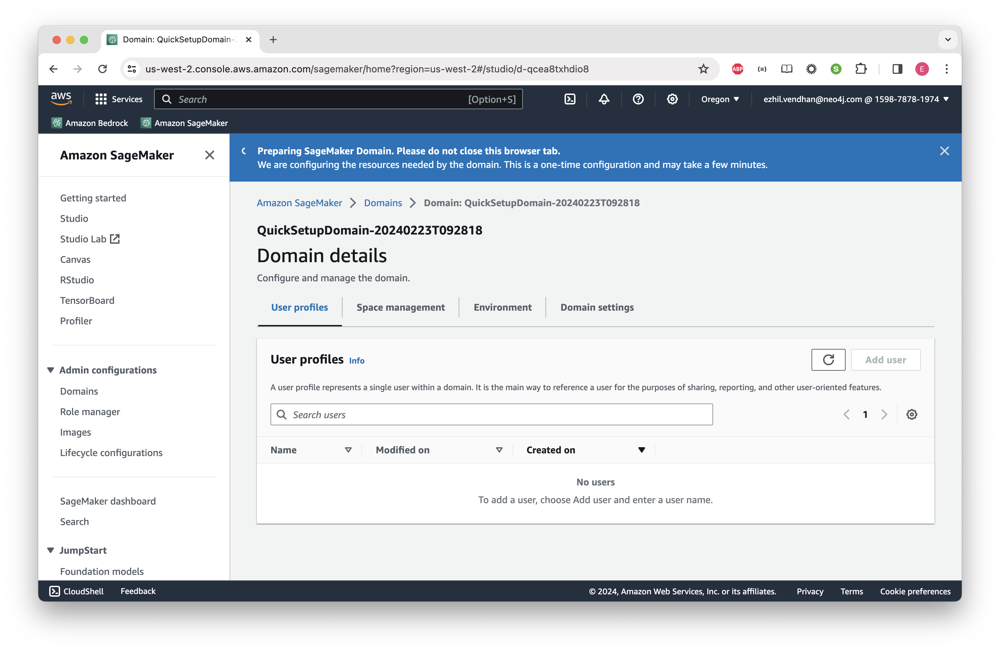

It will take a few minutes to complete. Once done, you will see as below.
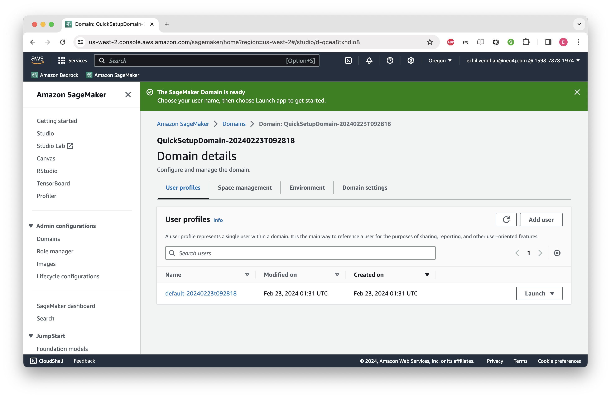

Click on the domain name.

Once it finishes, you'll see a message saying "The SageMaker Domain is ready."  Next to the default user, click "Launch" and select "Studio" under that.  You'll be put through a few redirects.

If the default user isn't shown, you may need to refresh the screen.
You will be landing in the Studio screen below.
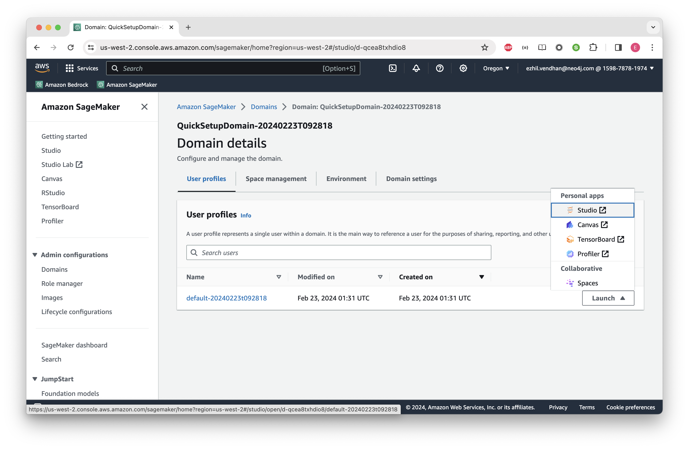

Click on the button with orange background - "Jupyter Lab".
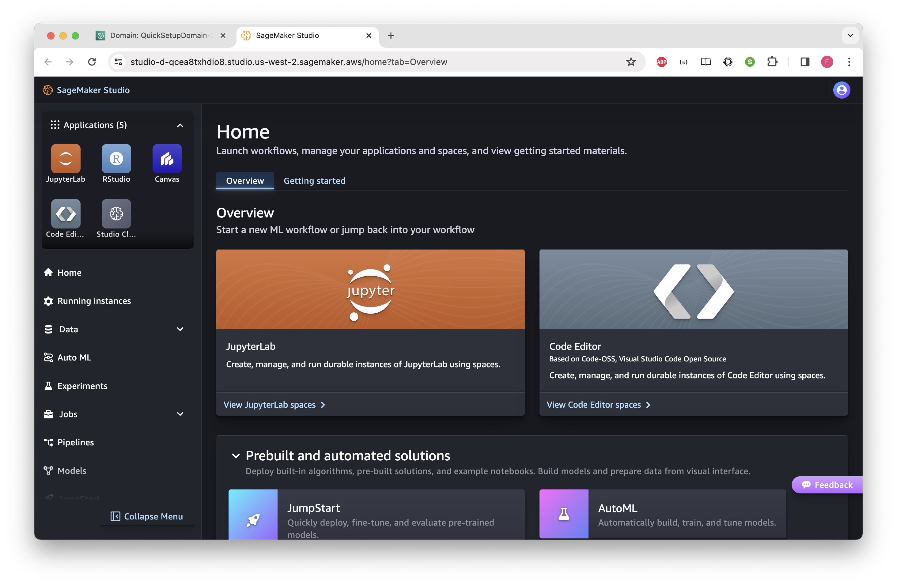

From the top right, click on "Create JupyterLab Space" button.
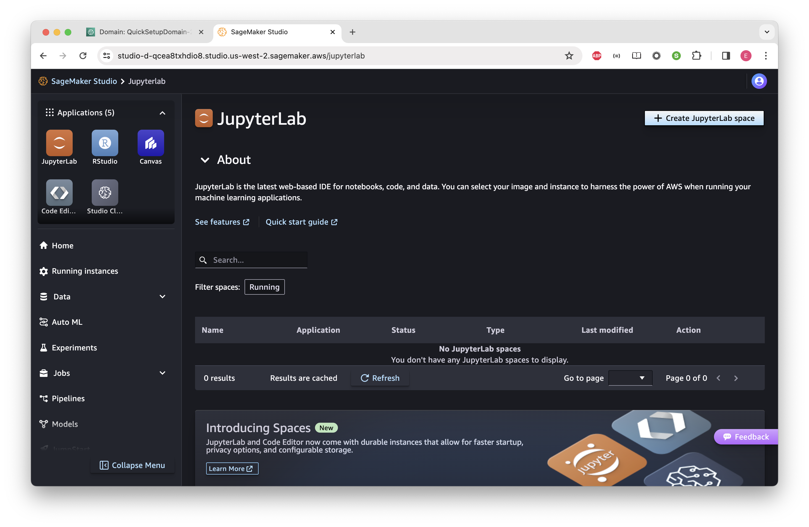

Provide a name for your Jupyter Lab space and click "Create Space"
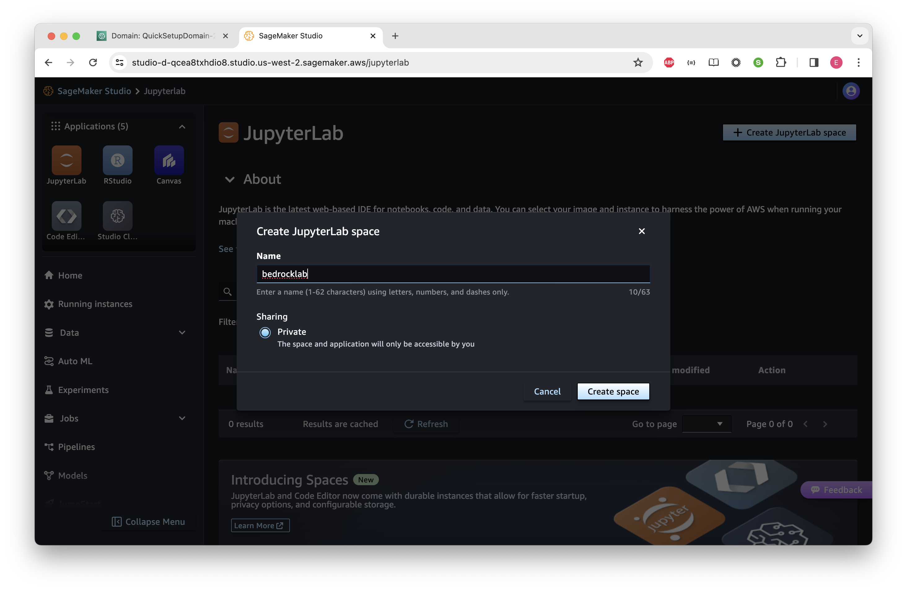

You will be landing in the page below. Wait for a few seconds to see the "Run space" button enabled.
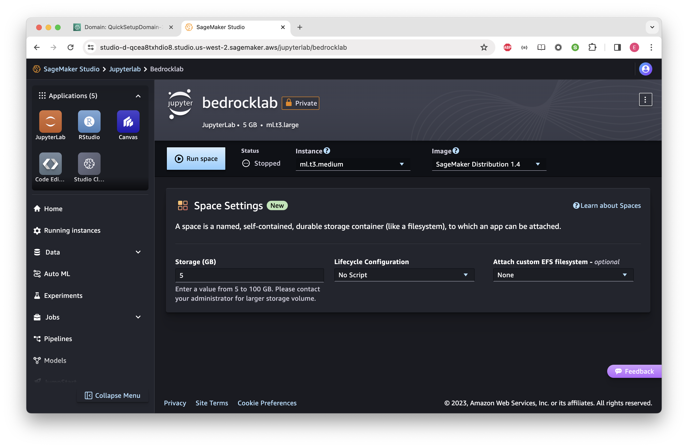

Leave the default values as-is and click "Run space" button.
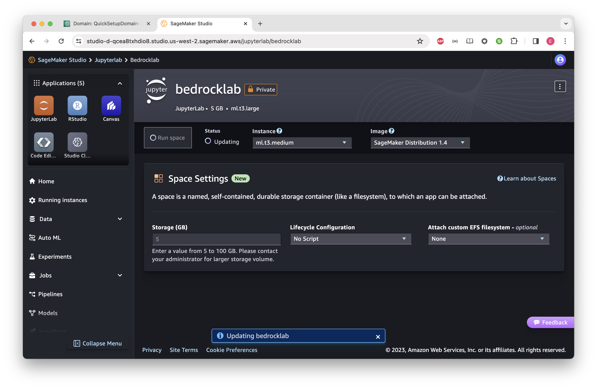

After a couple of minutes, you will see the space created and the "Open Jupyter Lab" button enabled. Click that button which will open a new window.
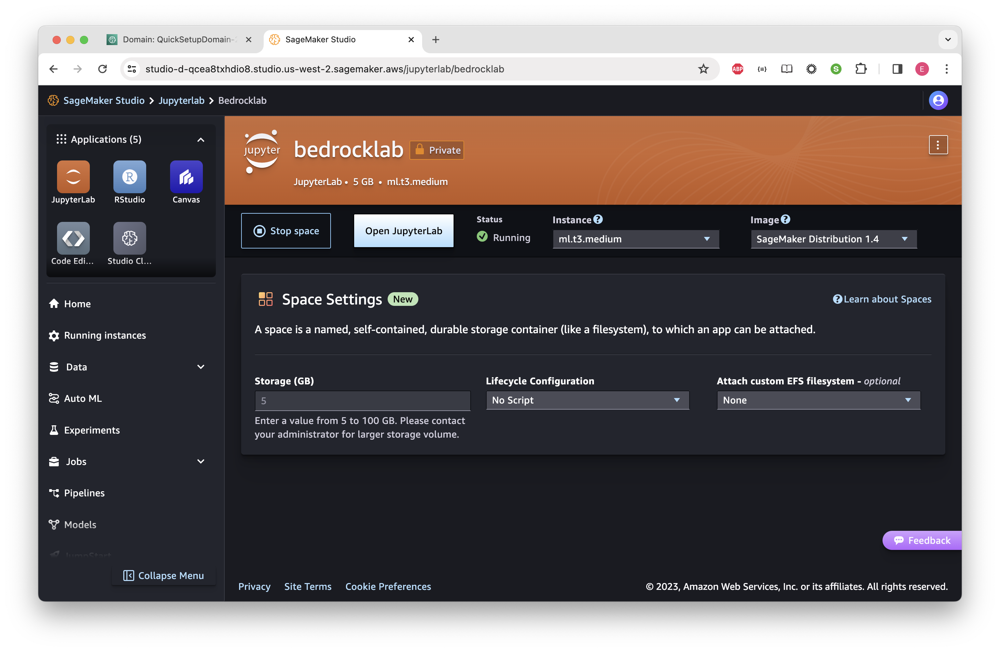

When the widnow is loaded, you'll land in SageMaker Studio.  This is Amazon's hosted notebook environment.

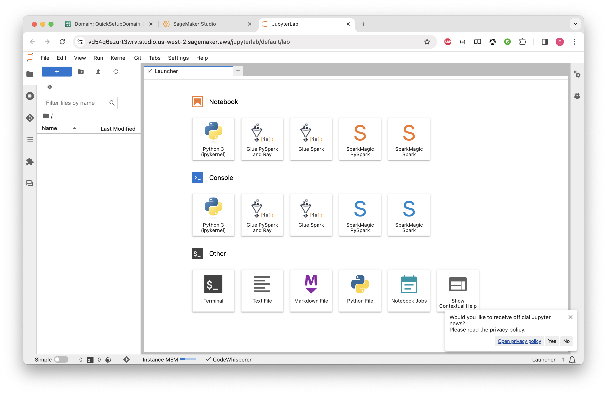

## Import from GitHub to SageMaker Studio
For the rest of the labs, we're going to be working with notebooks in SageMaker Studio.  To load them into Studio, we're going to pull them from GitHub using Studio's git integration.

Click on the git icon in the upper left of Studio.  It's below the folder icon on the extreme left of the menu.

Now click "Clone a Repository."

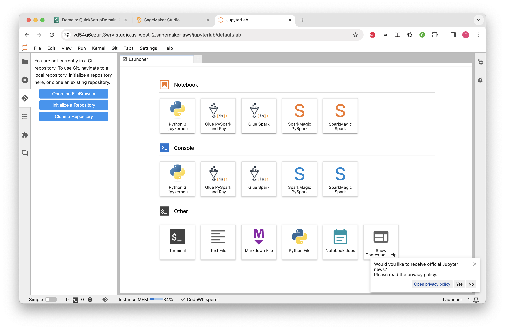

In the dialog, enter the address of the git file in the repo we've been working with.  That is:

    https://github.com/neo4j-partners/hands-on-lab-neo4j-and-bedrock.git

Then click "Clone."

This menu is a little finicky.  On my machine, I had to click on the URL after I pasted it and then click the "Clone" button.  If I didn't I receveived an error.

When complete, it will open the README.md for this repo.  In the file explorer on the left, double click on "Lab 5 - Parsing Data."  Click on "parsing-data.ipynb" to open it.

For image, select "Data Science 3.0."  That will populate the kernel and so on.

Click "Select."

You'll see a message that the kernel is starting.  It takes a while.  In my case, it was three minutes to start.  Once complete, you should see this.  Now you're all ready to run through this notebook!

In the next labs, we'll explore further with notebooks.