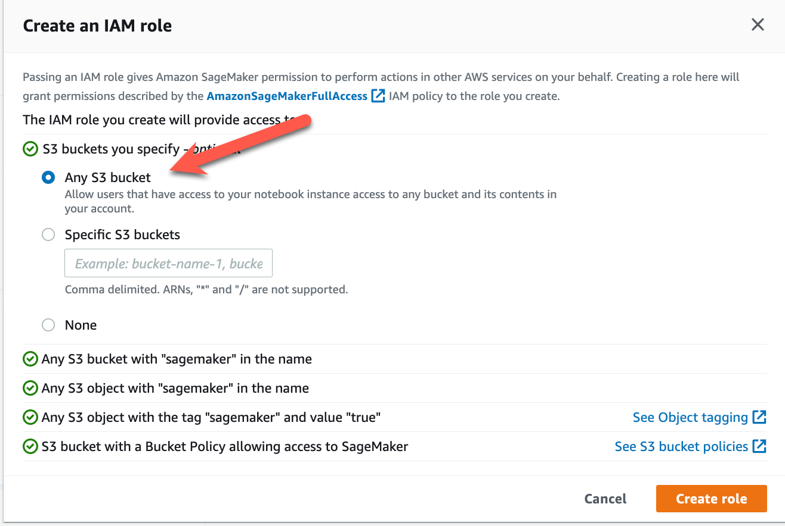
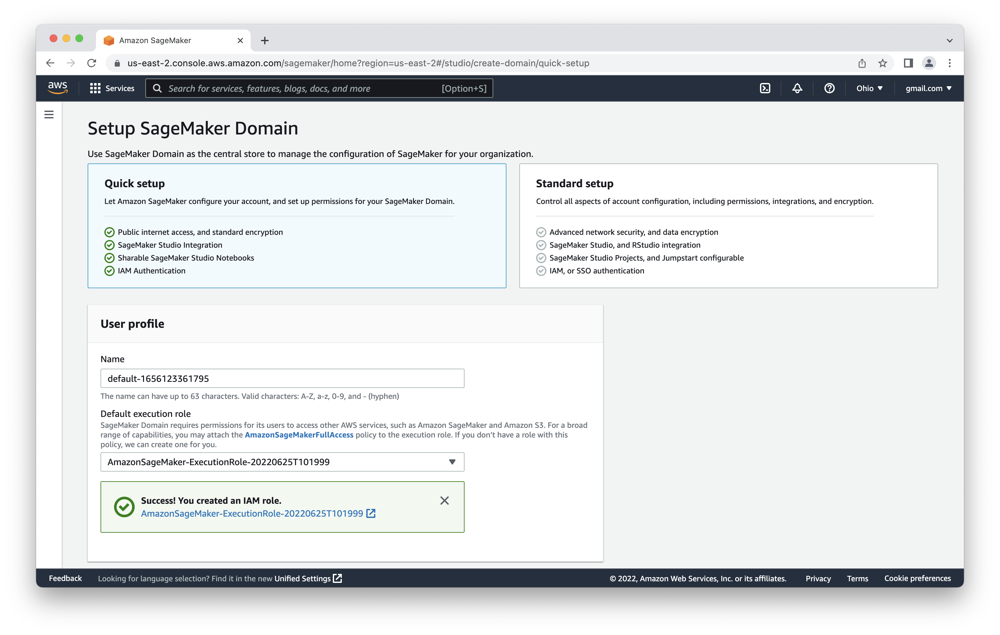
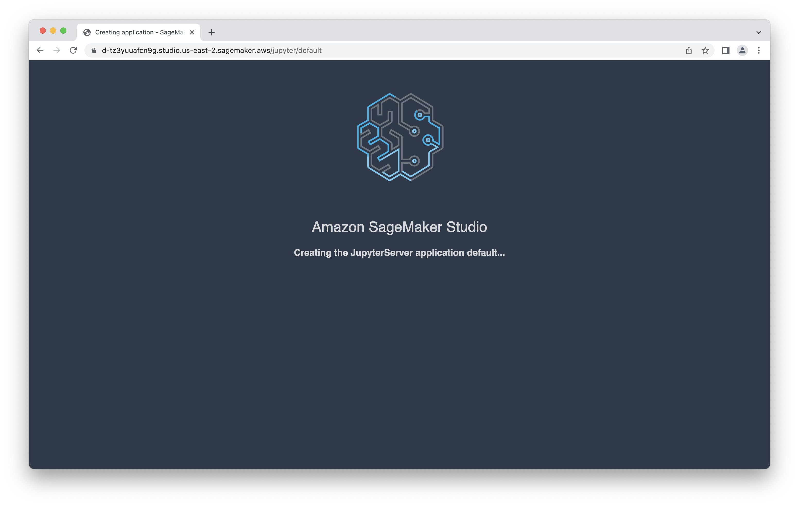
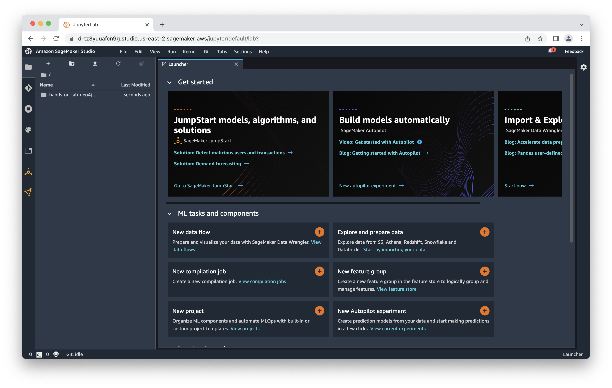

# Lab 5 - SageMaker
In this lab we're going to spin up a SageMaker domain.  We'll then use it to run two notebooks.  In later a later lab, we'll use SageMaker for supervised machine learning with Autopilot.  Autopilot attempts to featurize and tune models automatically, simplifying the task of creating a machine learning model.

## Create a SageMaker Domain
The first step is to deploy a SageMaker domain.  To do that, open the AWS console [here](https://console.aws.amazon.com/)

In the search bar, type "sagemaker." From the search results, click on "SageMaker Studio" under "Top Features".

That takes us to a wizard to setup our SageMaker domain.  In that screen, under "Default execution role," select "Create a new role."

In the role menu, be sure to select "Any s3 bucket" and select "Create role."

That'll create the role and bring you back to the setup menu.  You can now select "Submit."

You'll now get a message that it's deploying the SageMaker domain.  That will take a few minutes.

When it's all deployed, you'll see "InService" status.

Now that the domain is setup, let's launch SageMaker studio.  Click on the domain link and the "Domains details" page, click on "Launch" Then click on "Studio."

That'll then carry you through two redirect screens...

After that we land on the SageMaker Studio console.

## Import from GitHub to SageMaker Studio
For the rest of the labs, we're going to be working with iPython notebooks in SageMaker Studio.  To load them into Studio, we're going to pull them from GitHub using Studio's git integration.

Click on the git icon in the upper left of Studio.  It's below the folder icon on the extreme left of the menu.

Now click "Clone a Repository."

In the dialog, enter the address of the git file in the repo we've been working with.  That is:

    https://github.com/neo4j-partners/hands-on-lab-neo4j-and-sagemaker.git

Then click "CLONE."

It takes a little while to clone the repo (there are an awful lot of pictures in here...).  When complete you should see this.

Now we have all our notebooks.  In the next two labs we're going to use SageMaker Studio to run them.

## Pandas
First off, let's fiddle with the data in pandas.  We have a little notebook to help with that.  In the menu on the left, drill down into "/hands-on-lab-neo4j-and-sagemaker/Lab 5 - SageMaker/1_pandas.ipynb."

Select the default for the notebook environment and wait for the kernel to start.

Once that's complete, work through the notebook.

## Cypher
Now we'll run a few queries using the python API.  Earlier we used the graphical interface in the Neo4j Browser.  We're going to do the same thing but in a programmatic way.  Let's start by firing up a notebook.  As you did before, find the "/hands-on-lab-neo4j-and-sagemaker/Lab 5 - SageMaker/2_cypher.ipynb" in the Studio menu, fire up a kernel and then run through the notebook.
