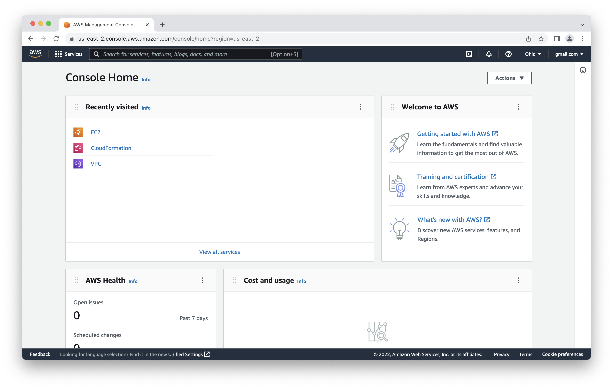
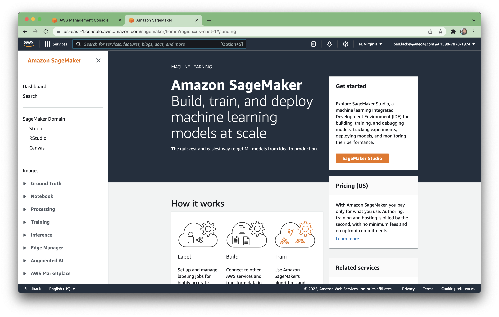
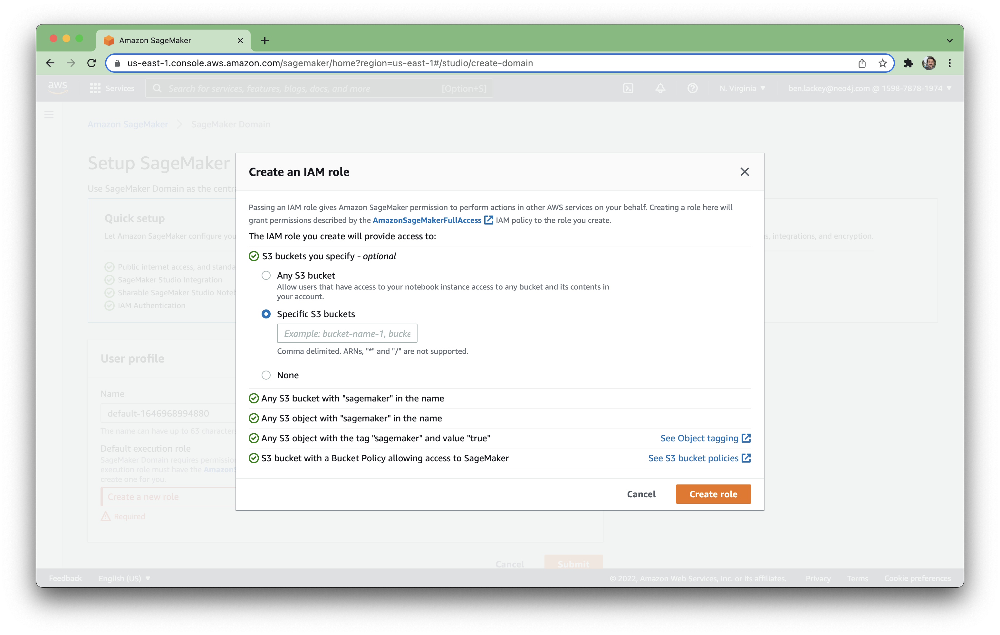
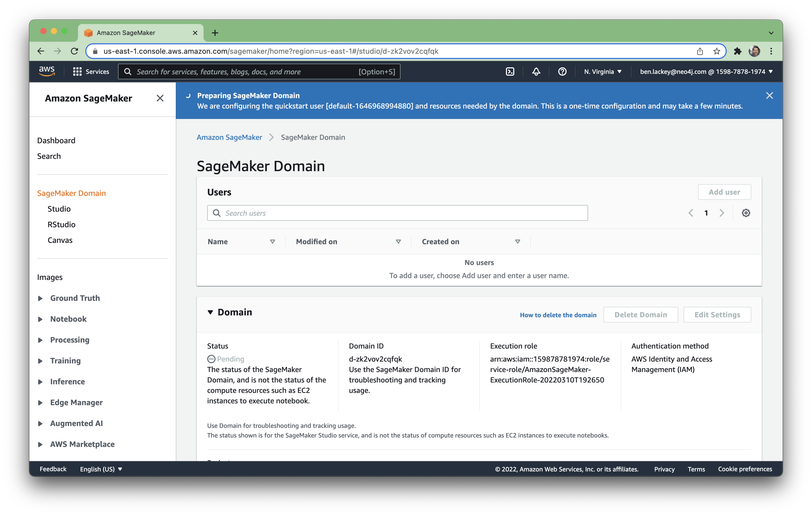

# Lab 6 - SageMaker
Now we've reached what we've been working toward -- pulling graph data into SageMaker.  We're going to spin up a SageMaker domain for this.  

## Create a SageMaker Domain
The first step is to deploy a SageMaker domain.  To do that, open the AWS console [here](https://console.aws.amazon.com/)

In the search bar, type "sagemaker" and then click on "SageMaker" under Services.

That'll take you to the SageMaker console.  Click on the orange "SageMaker Studio" button.

That takes us to a setup screen.  In that screen, under "Default execution role," select "Create a new role."

In the role menu, select "Any s3 bucket" and select "Create role."

That'll create the role and bring you back to the setup menu.  You can now select "Submit."

If you have multiple VPCs, you'll get a message about which VPC you want to use.  Select your default VPC.  

Then select the subnets under it and click "Save and continue."

You'll now get a message that it's deploying the SageMaker domain.  That will take a few minutes.

When it's all deployed, you'll see this message:

## SageMaker Studio
Now that the domain is setup, let's launch SageMaker studio.  In the AWS console, click on "Launch app" and then "Studio."

That'll then carry you through two redirect screens...

After that we land on the SageMaker Studio console.

## Pandas
First off, let's fiddle with the data in pandas.  Click [here](exploring_pandas.ipynb) to get started.

## Cypher Queries
Now we'll run a few queries using the python API.  Earlier we used the graphical interface in the Neo4j Browser.  We're going to do the same thing but in a programmatic way.  Let's start by firing up a notebook.  Click [here](exploring_cypher.ipynb) and then follow the "Run in Colab" link to open it in Google Colab.

