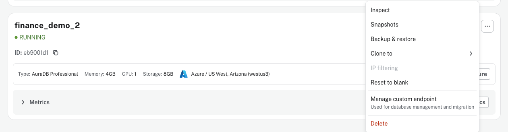
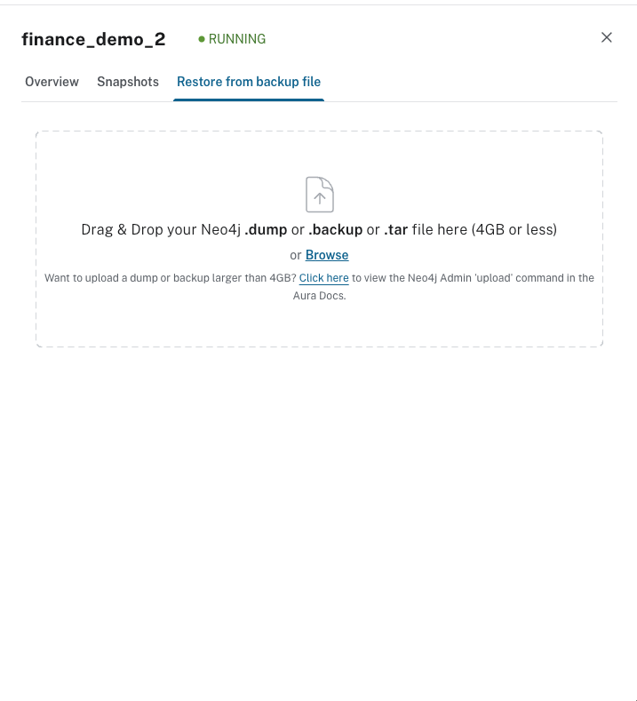
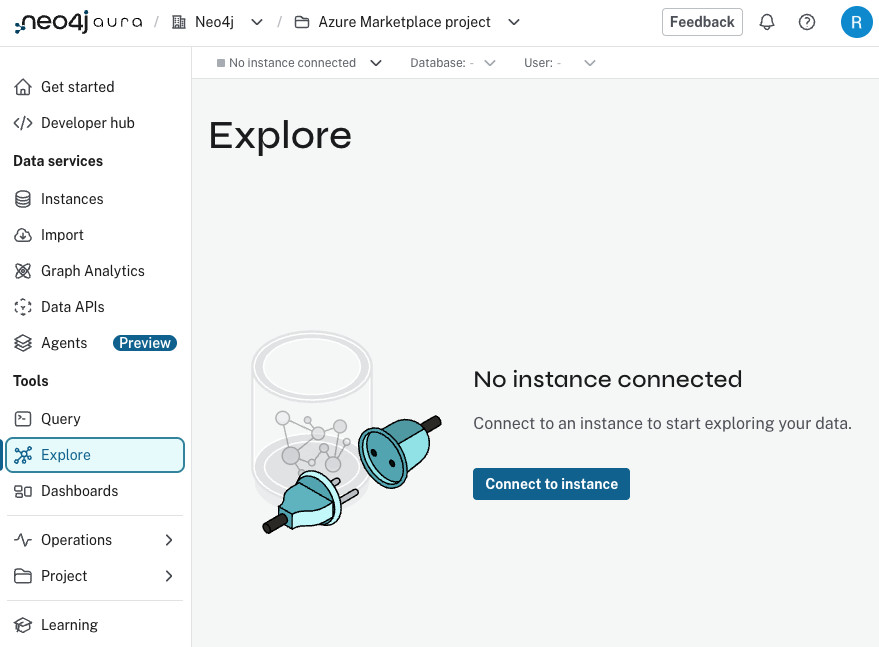
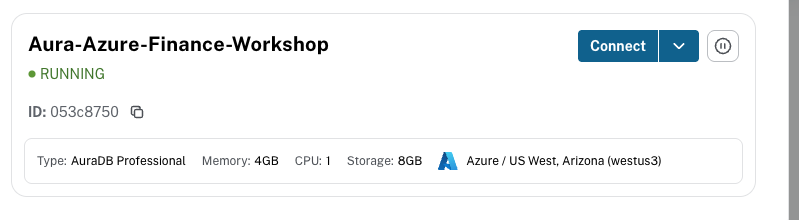
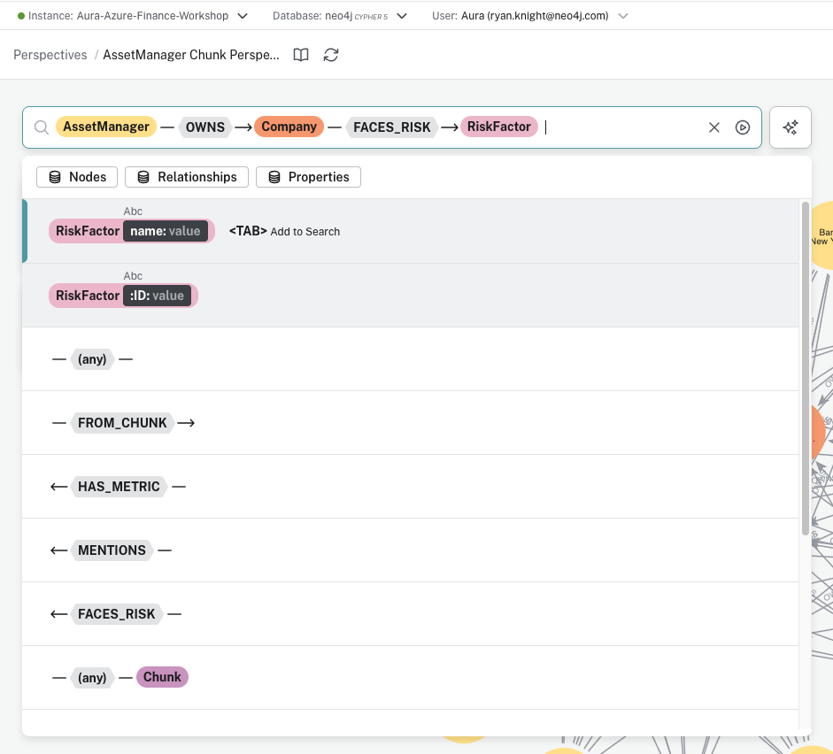
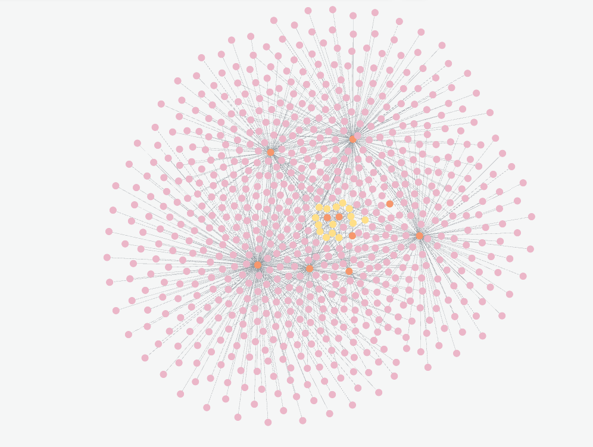
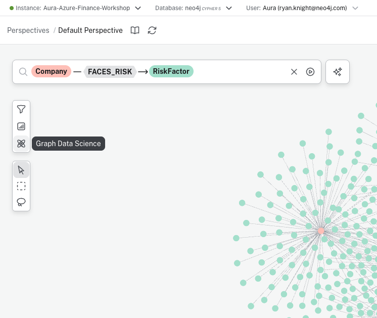
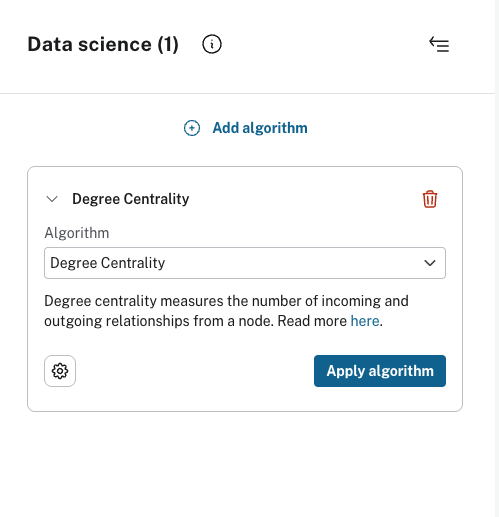
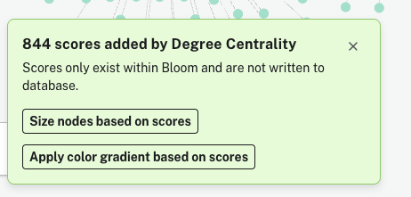
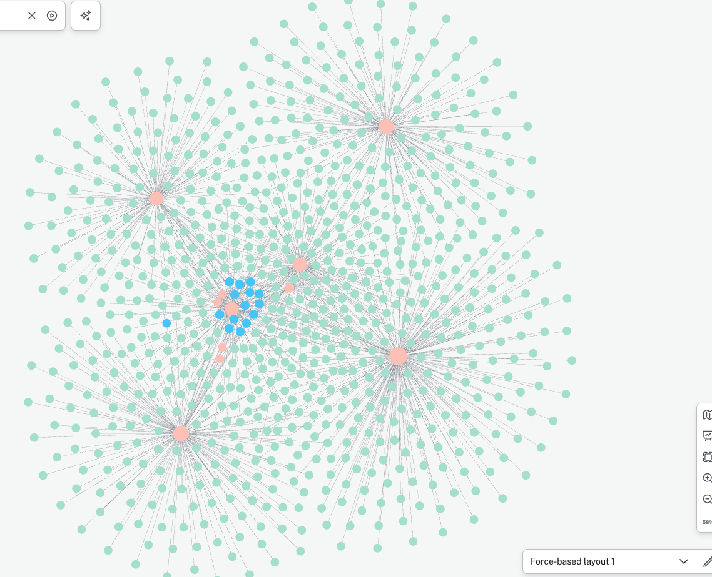

# Lab 1: Neo4j Aura Setup and Exploration

In this lab, you will set up your Neo4j Aura database on Azure Marketplace, restore the knowledge graph from a backup, and explore your graph visually.

## Prerequisites

- Completed **Lab 0** (Azure sign-in)
- Access to Azure Portal

## Part 1: Neo4j Aura Signup

Follow the instructions in [Neo4j_Aura_Signup.md](Neo4j_Aura_Signup.md) to:

1. Subscribe to Neo4j Aura through Azure Marketplace
2. Create your Neo4j Aura account
3. Configure and provision your database instance
4. Save your connection credentials

> **CRITICAL:** When your instance is created, you will be shown your database credentials (URI, username, and password) and given the option to download them as a file. **You must save these credentials immediately** - this is your only opportunity to see the password. Download the credentials file when prompted and store it somewhere safe. You will need these credentials in later labs to connect your applications to Neo4j.

## Part 2: Restore the Backup

After your Aura instance is running, restore the pre-built knowledge graph:

### Step 1: Download the Backup File

1. Download the backup file from GitHub:
   - **Download link:** [finance_data.backup](https://github.com/neo4j-partners/hands-on-lab-neo4j-and-bedrock/raw/refs/heads/main/Lab_1_Aura_Setup/data/finance_data.backup)
2. Save the file to a location you can easily find (e.g., your Downloads folder)

### Step 2: Upload to Aura

1. Go to your instance in the [Aura Console](https://console.neo4j.io)
2. Click the **...** menu on your instance and select **Backup & restore**

   

3. Click **Upload backup** to open the upload dialog
4. Drag the `finance_data.backup` file you downloaded into the dialog:

   

5. Wait for the restore to complete - your instance will restart with the SEC 10-K filings knowledge graph

The backup contains:
- SEC 10-K filing documents from major companies (Apple, Microsoft, NVIDIA, etc.)
- Extracted entities: Companies, Risk Factors, Products, Executives, Financial Metrics
- Asset manager ownership data
- Text chunks with vector embeddings for semantic search

## Part 3: Explore the Knowledge Graph

In this section, you will use Neo4j Explore to visually navigate and analyze your knowledge graph. You'll learn how to search for patterns, visualize relationships, and apply graph algorithms to gain insights from your data.

### Step 1: Access the Aura Console

Go back to the Neo4j Aura console at [console.neo4j.io](https://console.neo4j.io).

### Step 2: Open Explore

In the left sidebar, click on **Explore** under the Tools section. This opens Neo4j's visual graph exploration tool.

Click **Connect to instance** to connect to your database.

### Step 3: Search for Asset Manager Relationships

In the search bar, build a pattern to explore the relationships between asset managers, companies, and risk factors. Type `AssetManager`, then select the **OWNS** relationship, followed by **Company**, then **FACES_RISK**, and finally **RiskFactor`.

This creates the pattern: `AssetManager — OWNS → Company — FACES_RISK → RiskFactor`

### Step 4: Visualize the Knowledge Graph

After executing the search, you'll see a visual representation of the knowledge graph. The graph shows AssetManager nodes (orange) connected to Company nodes (pink) through OWNS relationships, and Company nodes connected to RiskFactor nodes (yellow) through FACES_RISK relationships. The visualization reveals how different asset managers are exposed to various risk factors through the companies they own.

**Tips for Exploring:**

*Zoom and Pan*
- **Zoom**: Scroll wheel or pinch gesture
- **Pan**: Click and drag the canvas
- **Center**: Double-click on empty space

*Inspect Nodes and Relationships*
- Click on a node to see its properties
- Click on a relationship to see its type
- Expand nodes to see more connections

### Step 5: Access Graph Data Science

To analyze the graph structure, click on the **Graph Data Science** button in the left toolbar. This opens the data science panel where you can apply graph algorithms.

### Step 6: Apply Degree Centrality Algorithm

Click **Add algorithm** and select **Degree Centrality** from the dropdown. This algorithm measures the number of incoming and outgoing relationships for each node, helping identify the most connected nodes in your graph.

Click **Apply algorithm** to run the analysis.

### Step 7: Size Nodes Based on Scores

After the algorithm completes, you'll see a notification showing how many scores were added. Click **Size nodes based on scores** to visually represent the centrality - nodes with more connections will appear larger.

### Step 8: Analyze the Results

The graph now displays nodes sized according to their degree centrality scores. Asset managers (pink/salmon nodes) that own more companies appear larger, making it easy to visually identify the most significant institutional investors in your dataset.

## Next Steps

After completing this lab, continue to [Lab 2 - Aura Agents](../Lab_2_Aura_Agents) to build an AI-powered agent using the Neo4j Aura Agent no-code platform.
