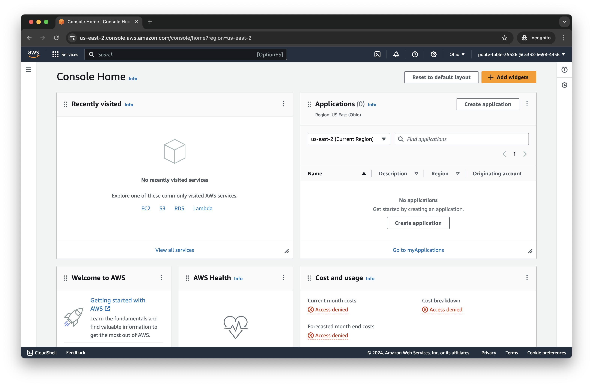
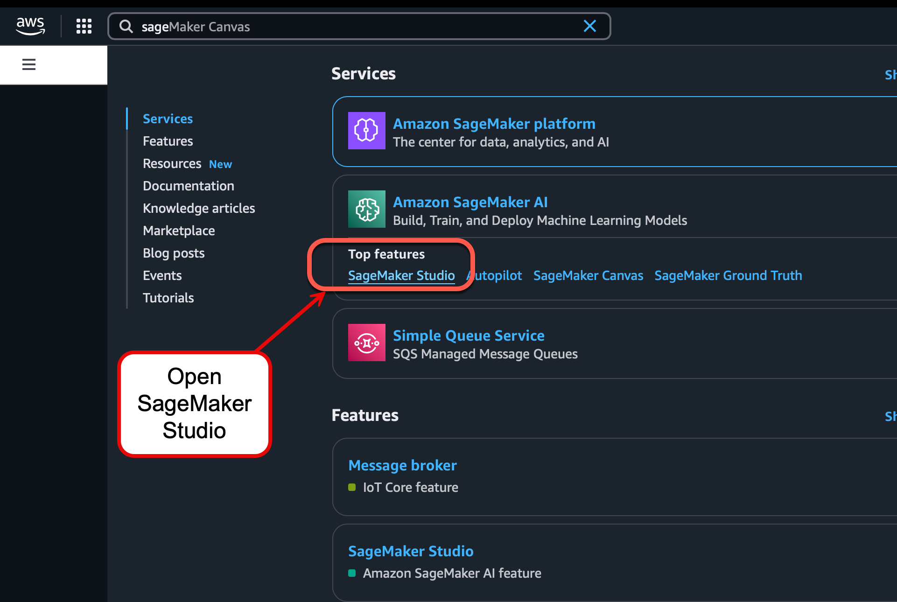
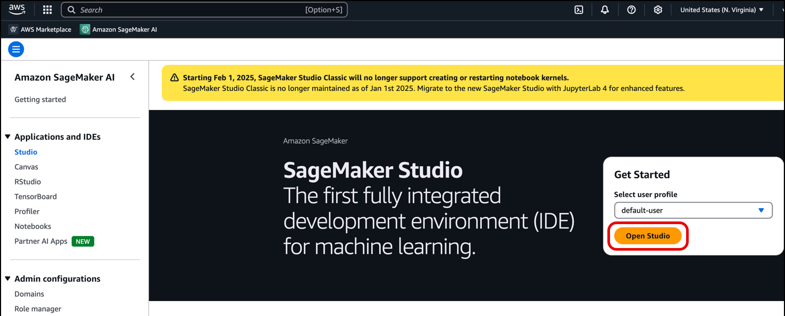
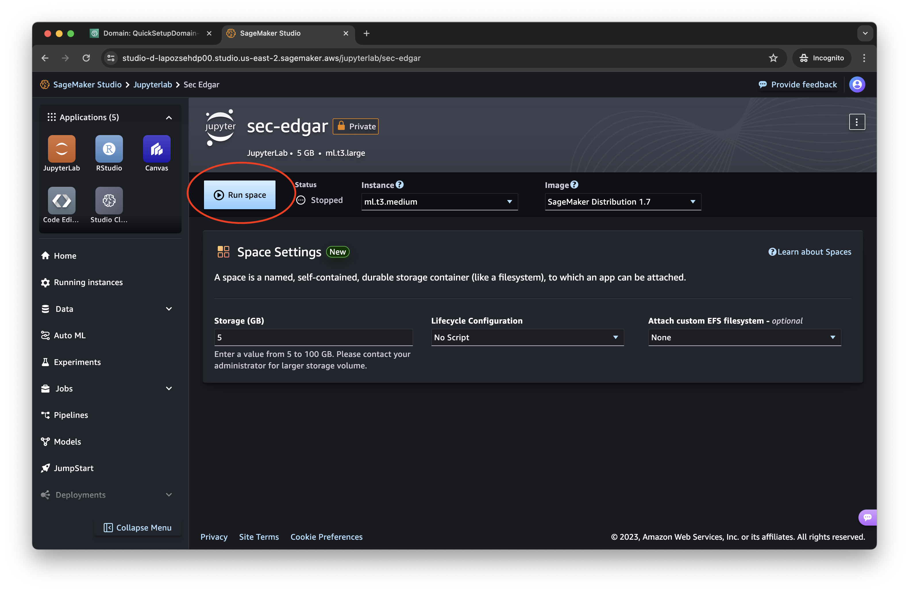
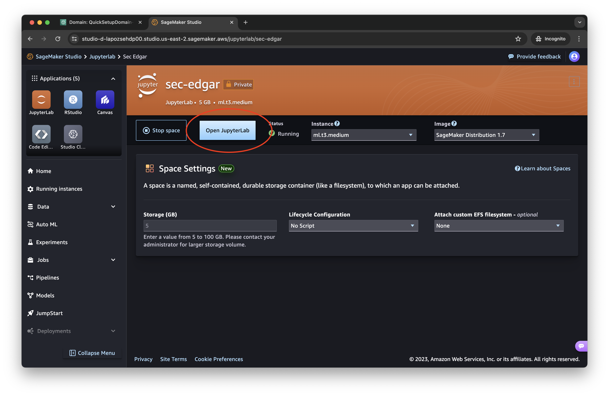
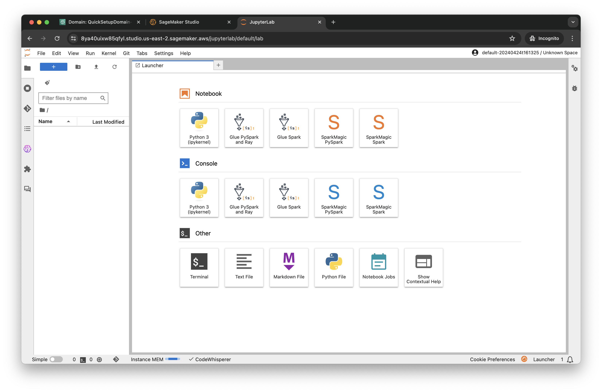
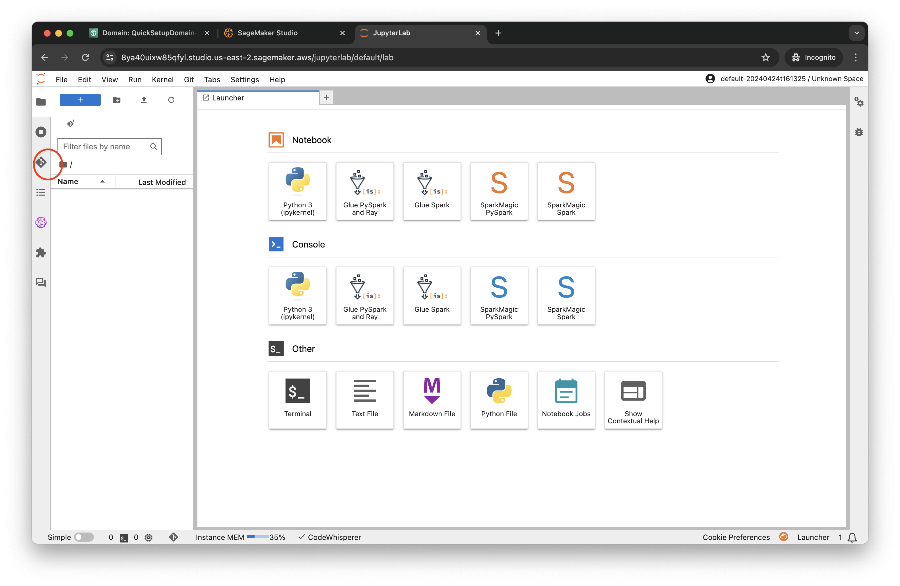
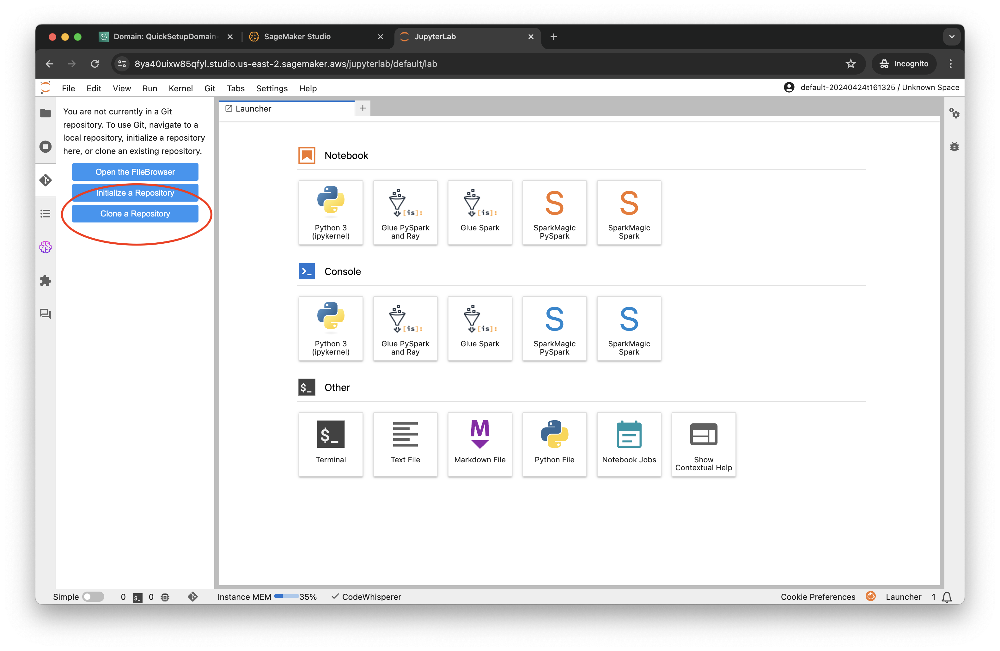
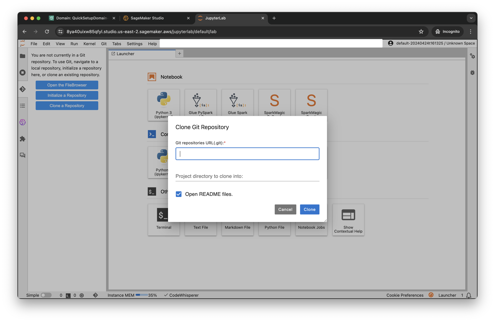
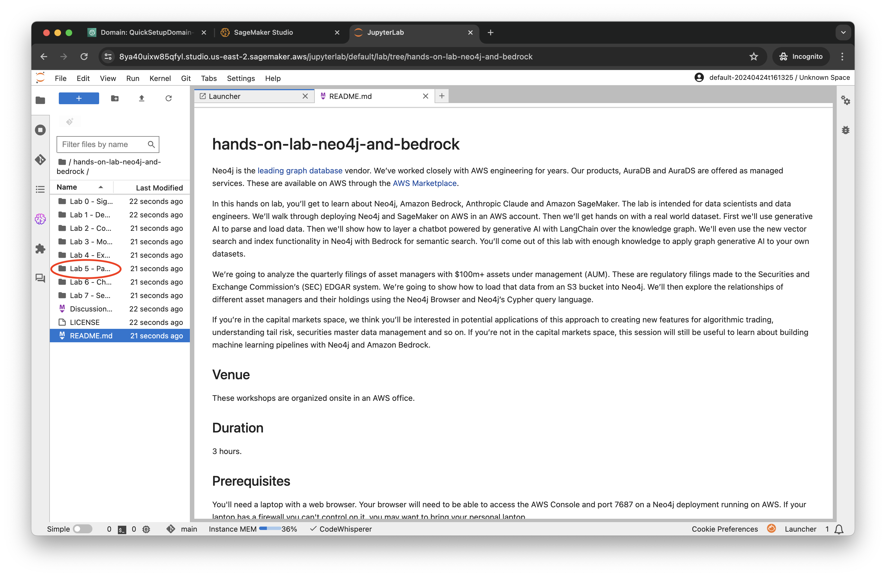

# Lab 4 - SageMaker Setup

In this lab, you'll set up Amazon SageMaker Studio and clone the workshop repository. This prepares your development environment for building AI agents that connect to Neo4j using the Model Context Protocol (MCP).

## Pre-Workshop Setup (For Organizers)

> **Note:** If you're a workshop attendee, skip this section. Your organizer may have already set everything up for you.

Workshop organizers can pre-provision accounts using the scripts in `setup-scripts/`:

```bash
cd setup-scripts

# Option 1: CloudFormation (single account, full automation)
aws cloudformation create-stack \
  --stack-name bedrock-agents-lab \
  --template-body file://datazone-lab-stack.yaml \
  --capabilities CAPABILITY_NAMED_IAM

# Option 2: CLI scripts (multiple accounts)
./setup-datazone.sh                              # Create DataZone domain/project
./setup-datazone.sh --add-user user/attendee-1   # Add attendees
./setup-bedrock-lab-org.sh 123456789012          # Provision account(s)
```

If pre-provisioned, attendees will have:
- DataZone domain and project ready
- `BedrockLabRole` with all required permissions
- Inference profiles already created with proper tags

See `setup-scripts/SETUP.md` for details.

## Create a SageMaker Domain

Open the AWS console at [console.aws.amazon.com](https://console.aws.amazon.com/). In the search bar, type "sagemaker."



From the search results, click on "SageMaker Studio" under "Amazon SageMaker AI."



A SageMaker Domain is a container for notebooks and other artifacts deployed within SageMaker. It can be deployed to be shared across an entire data science department. However, for our uses, we only need a single user.

Click "Set up for single user."



Click on the button with orange background - "JupyterLab".


From the top right, click on "Create JupyterLab Space" button.


Provide a name for your JupyterLab space, perhaps "neo4j-mcp-agent."


Click "Create Space"


You will land on the page below. Wait for a few seconds to see the "Run space" button enabled.

Click the "Run space" button.



After a couple of minutes, you will see the space created and the "Open JupyterLab" button enabled. Click that button which will open a new window.



When the window is loaded, you'll land in SageMaker Studio. This is Amazon's hosted notebook environment.



## Import from GitHub to SageMaker Studio

For the rest of the labs, we're going to be working with notebooks in SageMaker Studio. To load them into Studio, we're going to pull them from GitHub using Studio's git integration.

Click on the git icon in the upper left of Studio. It's below the folder icon on the extreme left of the menu.



Now click "Clone a Repository."



In the dialog, enter the address of the git repo:

    https://github.com/neo4j-partners/hands-on-lab-neo4j-and-bedrock.git

Then click "Clone."



When complete, it will open the README.md for this repo. In the file explorer on the left, double click on "Lab_4_SageMaker_Setup."



## Test LangGraph with Bedrock

Verify your SageMaker environment is working correctly with AWS Bedrock by running the minimal agent notebook.

### Step 1: Check for Existing Inference Profiles

First, check if inference profiles were already created by your workshop organizer:

```bash
cd hands-on-lab-neo4j-and-bedrock/Lab_4_SageMaker_Setup
./setup-inference-profile.sh --list
```

If you see profiles listed (e.g., `langgraph-lab-haiku` or `{domain_id} {project_id} haiku`), skip to Step 2.

### Step 1b: Create an Inference Profile (If Needed)

If no profiles exist, create one. SageMaker Unified Studio requires application inference profiles with special tags. The `setup-inference-profile.sh` script creates these for you.

Open a terminal in JupyterLab (File → New → Terminal) and run:

```bash
cd hands-on-lab-neo4j-and-bedrock/Lab_4_SageMaker_Setup
./setup-inference-profile.sh haiku
```

The script will:
- Auto-detect your DataZone project and domain IDs
- Create an inference profile with the required `AmazonBedrockManaged=true` tag
- Output the ARN to copy into your notebook

**Available models:**

| Command | Model | Best For |
|---------|-------|----------|
| `./setup-inference-profile.sh haiku` | Claude 3.5 Haiku | Testing (fast, cheap) |
| `./setup-inference-profile.sh sonnet` | Claude 3.5 Sonnet v2 | Balanced performance |
| `./setup-inference-profile.sh sonnet4` | Claude Sonnet 4 | Latest capabilities |
| `./setup-inference-profile.sh sonnet45` | Claude Sonnet 4.5 | Most capable |

**Useful options:**

```bash
./setup-inference-profile.sh --test haiku   # Create and verify it works
./setup-inference-profile.sh --list         # Show existing profiles
./setup-inference-profile.sh --all          # Create profiles for all models
./setup-inference-profile.sh --help         # See all options
```

> **Note:** If you get permission errors, you may need IAM permissions. See `setup-iam.sh --help` or ask your workshop organizer.

### Step 2: Run the Test Notebook

1. Open `minimal_langgraph_agent.ipynb` in this lab folder
2. Copy the `INFERENCE_PROFILE_ARN` from the script output into the notebook
3. Run through the cells to test a simple LangGraph agent

This step confirms that LangGraph and Bedrock are working before you add the MCP complexity in Lab 5.

---

## Model Configuration: Why It's Different in Each Environment

AWS Bedrock models can be referenced in several ways, but **the correct approach depends on your environment**:

### The Challenge

SageMaker Unified Studio uses a **permissions boundary** (`SageMakerStudioProjectUserRolePermissionsBoundary`) that restricts direct Bedrock model access. This boundary only allows `bedrock:InvokeModel` on inference profiles with the `AmazonBedrockManaged=true` tag.

### Three Ways to Reference Models

| Format | Example | Works in SageMaker? | Works Locally? |
|--------|---------|---------------------|----------------|
| **Base model ID** | `anthropic.claude-3-5-haiku-20241022-v1:0` | No | Yes |
| **Cross-region inference profile** | `us.anthropic.claude-sonnet-4-5-20250929-v1:0` | No | Yes |
| **Application inference profile ARN** | `arn:aws:bedrock:us-west-2:ACCOUNT:application-inference-profile/ID` | Yes (if properly tagged) | Yes |

### Notebook Configuration (SageMaker)

Notebooks running in SageMaker **must use application inference profile ARNs** created by the setup script:

```python
# From setup-inference-profile.sh output
MODEL = "haiku"
INFERENCE_PROFILE_ARN = "arn:aws:bedrock:us-west-2:ACCOUNT:application-inference-profile/ID"

# For langchain-aws - requires provider and base_model_id
BASE_MODEL_IDS = {
    "haiku": "anthropic.claude-3-5-haiku-20241022-v1:0",
    "sonnet": "anthropic.claude-3-5-sonnet-20241022-v2:0",
    "sonnet4": "anthropic.claude-sonnet-4-20250514-v1:0",
    "sonnet45": "anthropic.claude-sonnet-4-5-20250929-v1:0",
}

llm = ChatBedrockConverse(
    model=INFERENCE_PROFILE_ARN,
    provider="anthropic",                    # Required when using ARN
    base_model_id=BASE_MODEL_IDS[MODEL],     # Bypasses GetInferenceProfile call
    region_name="us-west-2",
)

# For neo4j-graphrag
llm = BedrockLLM(
    model_id=INFERENCE_PROFILE_ARN,
    region_name="us-west-2",
)
```

**Why `base_model_id`?** The `langchain-aws` library calls `bedrock:GetInferenceProfile` which SageMaker roles don't have permission for. Adding `base_model_id` bypasses this call.

### Local Python Configuration

When running outside SageMaker (locally, EC2, Lambda), you can use cross-region inference profile IDs directly:

```python
# Cross-region inference profile ID (simpler, works outside SageMaker)
AWS_BEDROCK_INFERENCE_PROFILE_ID = "us.anthropic.claude-sonnet-4-5-20250929-v1:0"

# For neo4j-graphrag
llm = BedrockLLM(
    inference_profile_id=AWS_BEDROCK_INFERENCE_PROFILE_ID,
    region_name="us-west-2",
)
```

### Common Errors

| Error | Cause | Fix |
|-------|-------|-----|
| `AccessDeniedException: bedrock:InvokeModel` | Profile missing `AmazonBedrockManaged=true` tag | Recreate with `./setup-inference-profile.sh` |
| `AccessDeniedException: bedrock:GetInferenceProfile` | SageMaker role lacks this permission | Add `base_model_id` parameter |
| `ValidationException: provider` | Using ARN without provider param | Add `provider="anthropic"` |

### Setup Scripts

This lab includes two setup scripts:

#### setup-inference-profile.sh

Creates properly tagged inference profiles for SageMaker Unified Studio:

```bash
./setup-inference-profile.sh haiku      # Create haiku profile
./setup-inference-profile.sh sonnet45   # Create Claude Sonnet 4.5 profile
./setup-inference-profile.sh --list     # Show profiles with tag status
./setup-inference-profile.sh --help     # See all options
```

The script adds required tags:
- `AmazonBedrockManaged` = `true` (the key tag for SageMaker access)
- `AmazonDataZoneProject` = `{project_id}`
- `AmazonDataZoneDomain` = `{domain_id}`

#### setup-iam.sh

Creates and attaches IAM permissions (only needed if using your own AWS account):

```bash
./setup-iam.sh --list-roles              # List SageMaker execution roles
./setup-iam.sh --attach YOUR_ROLE_NAME   # Create policy and attach
./setup-iam.sh --check YOUR_ROLE_NAME    # Verify permissions
./setup-iam.sh --help                    # See all options
```

> **When to use:** Only run `setup-iam.sh` if you're using your own AWS account and getting permission errors. Workshop accounts pre-provisioned with `setup-scripts/` already have the required IAM permissions.

### Script Summary

| Script | Purpose | When to Use |
|--------|---------|-------------|
| `setup-inference-profile.sh` | Create inference profiles | Always (check with `--list` first) |
| `setup-iam.sh` | Create/attach IAM policy | Only if permission errors |
| `setup-scripts/setup-datazone.sh` | Create DataZone domain/project | Workshop organizers only |
| `setup-scripts/setup-bedrock-lab-org.sh` | Provision multiple accounts | Workshop organizers only |

---

## Next Steps

Continue to [Lab 5 - Neo4j MCP Agent](../Lab_5_Neo4j_MCP_Agent) to build an AI agent that queries your Neo4j knowledge graph using the Model Context Protocol.
